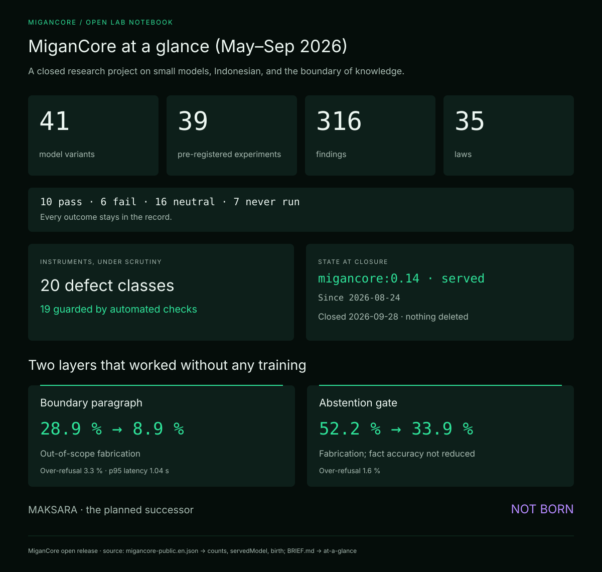
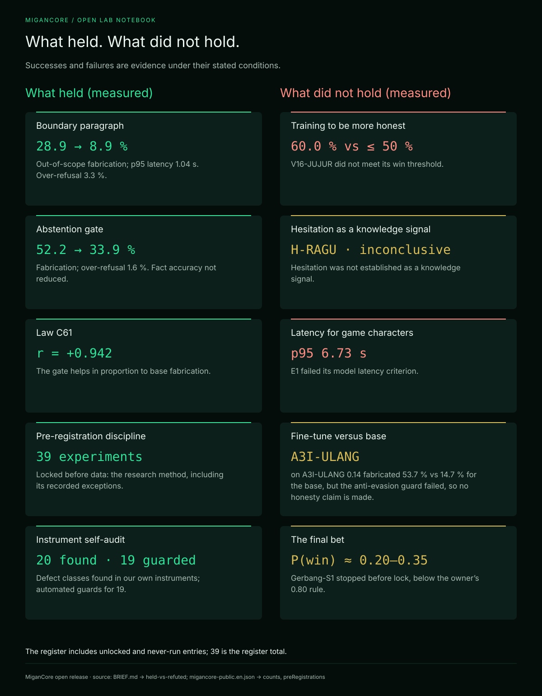
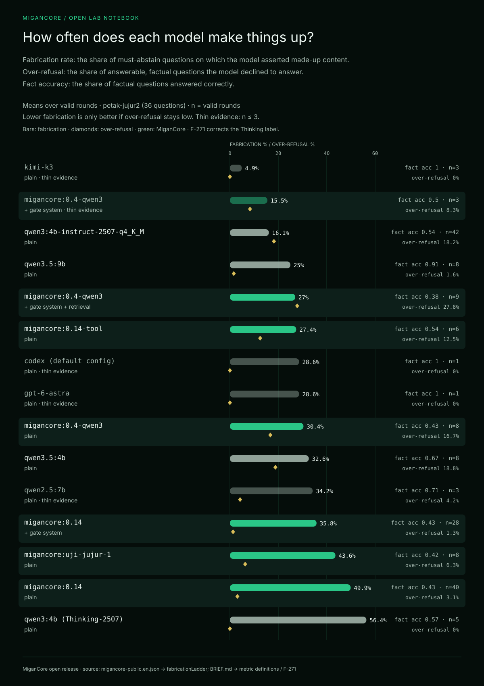
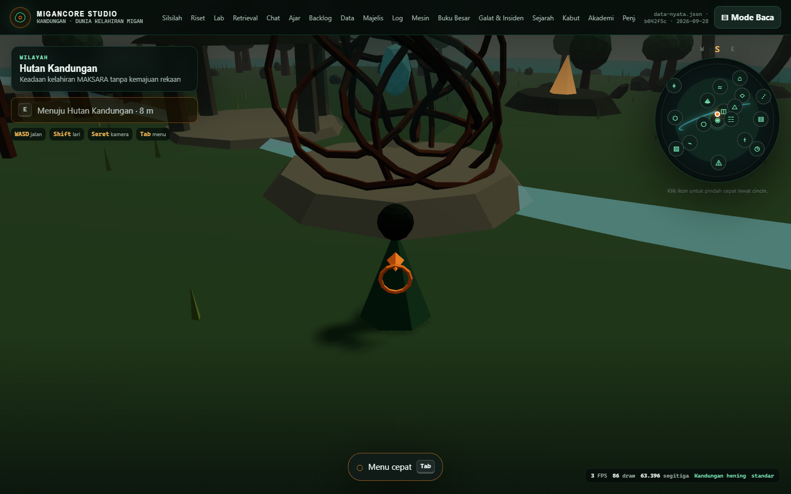
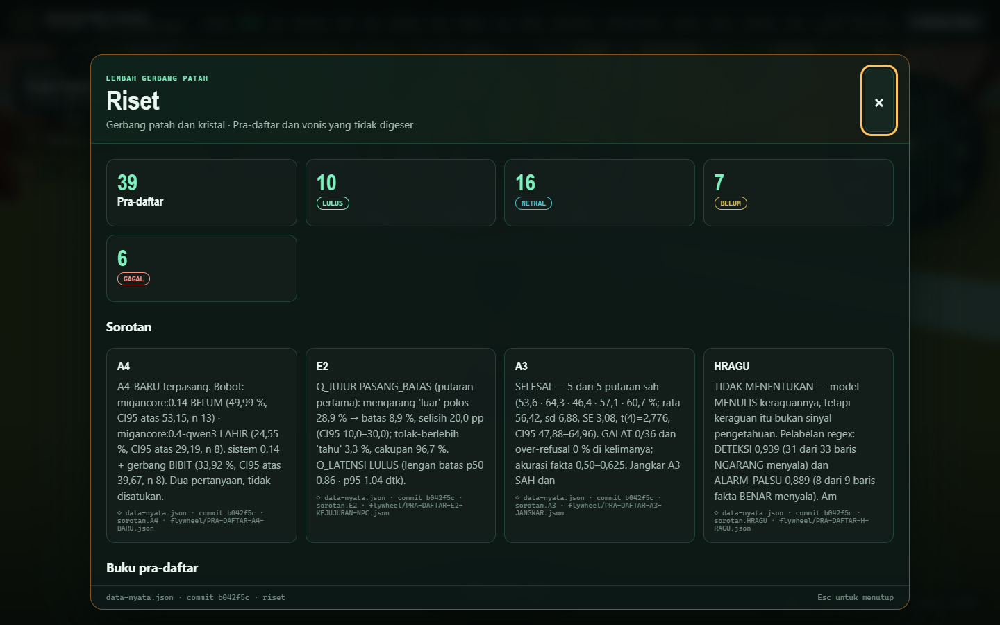
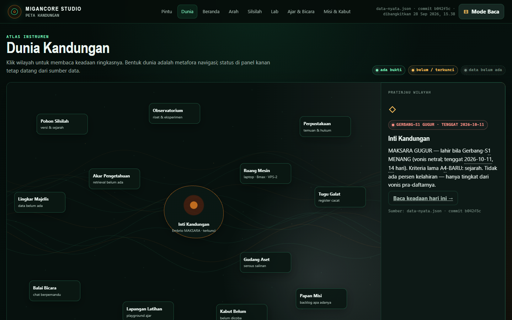
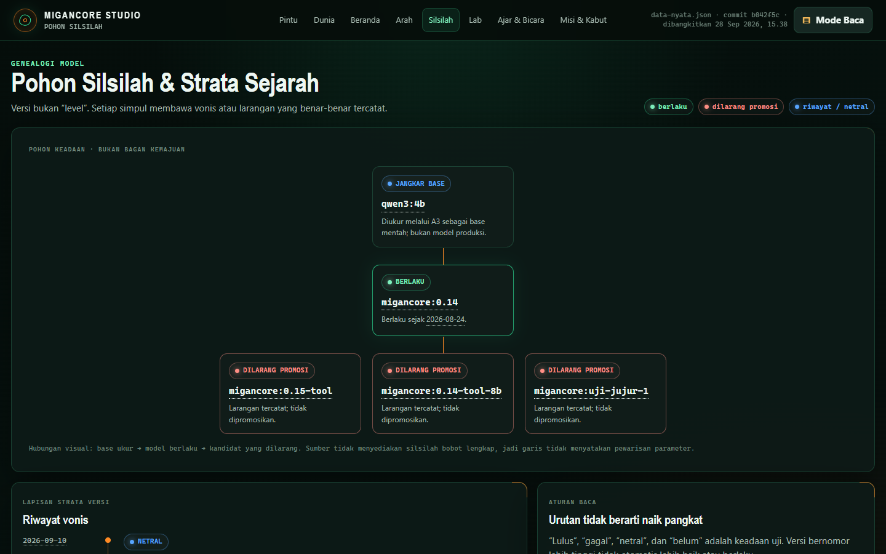
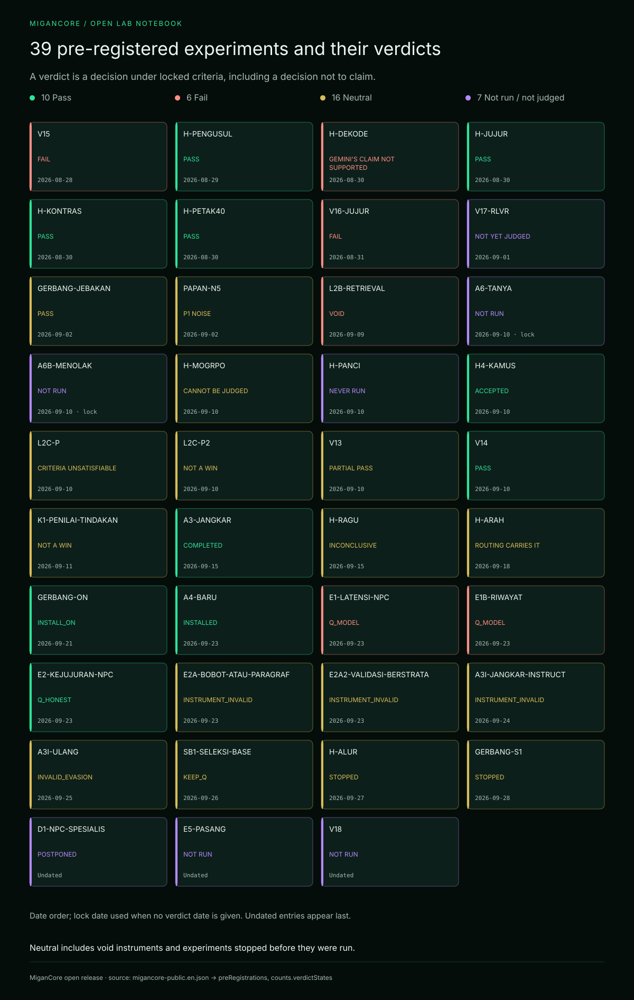
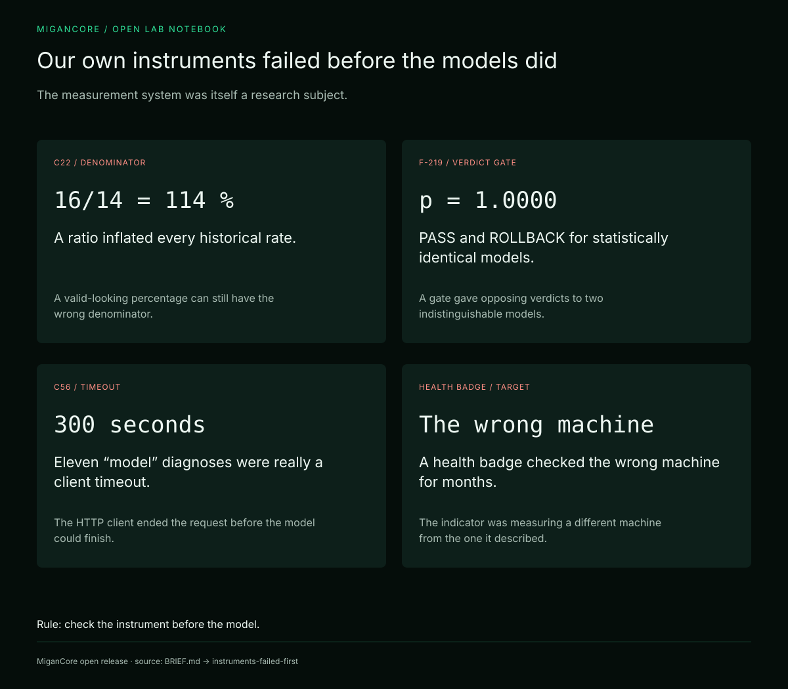

# MiganCore — buku laboratorium terbuka

**Upaya satu orang untuk memiliki model bahasa Indonesia kecil yang tahu di mana batas pengetahuannya. Semuanya
diukur, dipra-daftarkan, dan ditulis, termasuk yang gagal.**

[English](README.md) · Bahasa Indonesia · Lisensi MIT · Status: **ditutup 28 September 2026** (diarsipkan,
tidak ada yang dihapus)

---

## Apa ini

Dari Mei sampai September 2026, MiganCore adalah proyek riset dengan tujuan sempit:
- mengambil model dasar terbuka (terutama **Qwen3-4B-Instruct-2507**, Apache-2.0);
- menyesuaikannya untuk bahasa Indonesia lewat latihan LoRA kecil di GPU sewaan;
- melayankannya di perangkat CPU biasa;
- memberinya satu kemampuan pembeda: **tahu di mana batas pengetahuannya sendiri, lalu berhenti di situ**.
  Model memilih abstain alih-alih mengarang.

Pekerjaan ini dilakukan satu pendiri, **Fahmi Ghani**, dengan agen AI (Claude dari Anthropic dan Codex dari
OpenAI) sebagai staf riset. Eksperimen penting **dipra-daftarkan** sebelum data ada. Hipotesis, ambang, dan
ramalannya dikunci di git sebelum eksperimen dijalankan. Vonisnya lalu ditulis balik ke berkas yang sama oleh
alat, bukan oleh tangan. Beberapa eksperimen dihentikan atau tidak pernah dikunci, dan berkasnya menyebut hal
itu.

Proyek ini ditutup pada **28 September 2026** menurut syarat mati yang ia pra-daftarkan sendiri. Repositori ini
adalah catatan riset yang sudah dibersihkan. Isinya:
- kode;
- alat ukur;
- 39 pra-daftar beserta vonisnya;
- silsilah 41 varian model;
- Studio yang memvisualkan semuanya;
- temuan yang sudah disintesis.

Tujuannya agar orang lain bisa memakai ulang yang berhasil dan menghindari yang gagal.

> **Repositori pendamping:** *metode* risetnya (pra-daftar, integritas pengukuran, 35 hukum, studi kasus, dan
> laporan penutup) ada di
> [fahmiwol/migancore-research-method](https://github.com/fahmiwol/migancore-research-method). Repositori ini
> adalah *sistem dan buktinya*.

## Hasil dalam satu layar

**Yang bertahan (terukur, dipra-daftarkan):**

| Lapisan | Hasil | Berkas vonis |
|---|---|---|
| Satu paragraf **batas pengetahuan** di persona | Mengarang pada soal di luar cakupan 28,9 % → 8,9 % (selisih 20,0 pp, CI 95 % 10,0–30,0); latensi p95 1,04 dtk | [`E2-KEJUJURAN-NPC`](flywheel/PRA-DAFTAR-E2-KEJUJURAN-NPC.json) |
| **Gerbang abstensi** di depan model | Mengarang 52,2 % → 33,9 % (selisih rata-rata 18,31 pp, CI 95 % 6,59–30,03); tolak-berlebih 1,6 %; akurasi fakta tidak turun (40,6 % → 42,9 %) | [`GERBANG-ON`](flywheel/PRA-DAFTAR-GERBANG-ON.json) |
| Hukum **C61** | Gerbang membantu sebanding dengan kadar mengarang model dasarnya (r = +0,942 pada 8 pasangan) | [hukum](https://github.com/fahmiwol/migancore-research-method/blob/main/docs/id/04-hukum.md) |

**Yang tidak bertahan:**
- **Melatih model agar lebih jujur.** V16-JUJUR mengarang 60,0 % terhadap ambang menang ≤ 50 %, dan tidak
  terbedakan dari model yang dilayankan.
- **Keraguan sebagai sinyal pengetahuan.** H-RAGU tidak menentukan: model menuliskan keraguannya, tetapi keraguan
  itu juga muncul pada jawaban yang benar.
- **Hasil latih lawan model dasarnya.** Pada 25 September, dengan permintaan yang identik, `migancore:0.14`
  mengarang pada 53,7 % soal wajib-abstain, sedangkan model dasarnya sendiri 14,7 %. Pengawal anti-mengelak yang
  dipra-daftarkan gagal: model dasar menolak 16,25 % soal faktual. Karena itu **tidak ada klaim kejujuran ke arah
  mana pun**. Lihat
  [laporan penutup](https://github.com/fahmiwol/migancore-research-method/blob/main/docs/id/09-laporan-penutup.md).
- **Taruhan terakhir.** Gerbang-S1, sebuah encoder keputusan kecil di depan LLM apa pun, dihentikan sebelum
  dikunci. Peluang menangnya hasil audit sekitar 0,20–0,35 (skenario terbaik ≈ 0,78), di bawah aturan pemilik
  proyek untuk lanjut hanya bila di atas 0,80.

Dalam satu kalimat: **lapisan di sekitar model bertahan; melatih bobot ke arah jujur tidak.**

## Seberapa sering tiap model mengarang

Semua model diukur dengan batre 36 soal yang sama (`petak-jujur2`), memakai rata-rata putaran sah (`n`). Angka
mengarang selalu ditampilkan bersama tolak-berlebih, karena model yang menolak semua pertanyaan tidak pernah
mengarang.

## Apa yang dibangun

### 1. MiganCore Studio — dunia 2D dan 3D di atas bukti

Studio adalah lensa satu pintu atas sumber-sumber kanonik. Setiap angka di dalamnya dirakit dari berkas
pra-daftar dan register saat cuplikannya dibangkitkan, dan yang berumur lebih dari tujuh hari ditandai basi.
Lihat [panduan Studio](docs/studio.md).

| Dunia 3D | Panel riset 3D |
|---|---|
|  |  |
| **Peta dunia 2D** | **Pohon silsilah** |
|  |  |

### 2. Sistem pra-daftar

Ada 39 berkas pra-daftar di [`flywheel/`](flywheel/). Tiap berkas memuat:
- hipotesis dengan dua cara salah;
- metrik dengan kebenaran-dasar yang tidak pernah disentuh penilai;
- ambang yang sudah dicek bisa dimenangkan;
- aturan berhenti dan ramalan berpeluang;
- amandemen yang hanya boleh memperketat;
- vonis yang ditulis balik oleh alat vonis.

Perintah `node migan.mjs status` mencetak semua vonis langsung dari berkas-berkas itu.

Daftar lengkapnya ada di [register eksperimen](docs/experiments.md).

### 3. Alat ukur yang mengaudit dirinya sendiri

Alat ukurnya terdiri dari:
- batre soal;
- protokol ≥ 5 putaran dengan interval kepercayaan 95 %;
- metrik berpasangan (mengarang, tolak-berlebih, dan akurasi fakta);
- model yang dipatok lewat sidik, bukan nama tag;
- alat vonis yang diuji mutasi;
- penjaga otomatis (`node migan.mjs periksa`).

Proyek ini mencatat **20 kelas cacat di peralatannya sendiri**, dan 19 di antaranya kini punya penjaga otomatis.
Kesalahan paling mahal di proyek ini ada di alat ukurnya, bukan di modelnya.

### 4. Lapisan jalur — yang berhasil tanpa latihan

Lapisan ini terdiri dari gerbang abstensi (probe dan entailment NLI), paragraf batas pengetahuan, retrieval per
maksud, dan routing. Semuanya berada di depan model, sehingga bekerja dengan model dasar apa pun. Lihat
[arsitektur](docs/architecture.md).

### 5. Empat puluh satu varian model, satu yang dilayankan

Rentangnya:
- keluarga kecil sebelum Qwen3 dan garis Qwen2.5-7B (Mei);
- siklus Qwen3-4B ke-8 sampai ke-14 (Juni);
- percobaan pilot (Juli);
- komponen LoRA "disiplin" (Agustus);
- `migancore:0.14` yang dilayankan;
- kandidat yang dilarang promosi, tidak pernah divonis, atau tidak pernah lahir.

Setiap entri memuat data, metode, hasil ukur, dan vonisnya di [silsilah](docs/lineage.md).

## Arsitektur

Dari bawah ke atas: bobot dasar → latihan (LoRA / DPO / merge → GGUF) → penyajian (Ollama di CPU dan server MCP)
→ lapisan jalur (gerbang, batas, retrieval, routing) → pengukuran → lingkar pra-daftar → lensa Studio. Tiga
aturan tidak pernah dilanggar:
- **penyajian berdaulat**: tidak ada routing ke model luar saat melayani;
- **guru hanya luring**;
- **data tidak pernah keluar**.

Rinciannya di [docs/architecture.md](docs/architecture.md) (bahasa Inggris).

## Satu bulan keputusan

## Jelajahi datanya

- **Penjelajah interaktif:** [`site/index.html`](site/index.html). Satu berkas mandiri: buka di peramban, atau
  kunjungi salinan yang di-hosting (lihat *Tautan*).
- **Data yang bisa dibaca mesin:**
  - [`data/migancore-public.id.json`](data/migancore-public.id.json) (sumber bahasa Indonesia) dan
    [`data/migancore-public.en.json`](data/migancore-public.en.json) (bahasa Inggris);
  - [`data/lineage.en.json`](data/lineage.en.json);
  - [`data/timeline.en.json`](data/timeline.en.json).

## Apa yang membedakan

Rinciannya, lengkap dengan bukti, ada di [docs/advantages-and-limits.md](docs/advantages-and-limits.md)
(bahasa Inggris). Singkatnya:
1. **Abstensi diukur, bukan diklaim.** Angka mengarang dan tolak-berlebih selalu dilaporkan bersama, lengkap
   dengan CI dan jumlah putaran.
2. **Lapisan jalur tidak terikat model.** Dua intervensi yang berhasil tidak butuh latihan. Paragraf batas
   terukur p95 1,04 dtk, masih di dalam ambang latensinya.
3. **Pra-daftar yang bergigi.** Vonis dihitung oleh alat yang membaca ambangnya dari berkas yang terkunci dan
   menolak menghitung sebelum waktunya.
4. **Kegagalan adalah bagian dari catatan.** Sebanyak 16 eksperimen netral, 6 gagal, dan 7 yang tidak pernah
   dijalankan diterbitkan di samping 10 yang lulus.
5. **Privasi lewat arsitektur.** Model dilayankan di perangkat sendiri, tanpa routing ke luar.

## Model dan bobot

- **`migancore:0.14`**, model yang dilayankan, diterbitkan sebagai artefak riset yang diarsipkan di
  Hugging Face: [Tiranyx/migancore-0.14](https://huggingface.co/Tiranyx/migancore-0.14). Isinya berkas GGUF
  Q4_K_M, dua adapter LoRA, resep merge TIES, dan Modelfile.
  - Ke-485 baris data latihnya dibuat oleh generator program yang deterministik. **Tidak ada model yang menulis,
    menulis ulang, atau menilai satu baris pun.**
  - Model ini hanya untuk riset: ia mengarang pada sekitar separuh soal yang seharusnya ia tolak.
- **Repo publik yang lebih lama** di akun yang sama sekarang memakai kartu yang menyatakan asal data latihnya.
  Repo itu adalah garis "soul" Qwen2.5-7B (Mei 2026) dan adapter SIDIX.
- **Varian lain tidak diterbitkan.** Data latihnya memuat keluaran layanan AI komersial, dokumen tulisan agen,
  atau bahan pribadi. Silsilahnya tetap lengkap di [lineage](docs/lineage.md).
- Model dasarnya, Qwen3-4B-Instruct-2507 (Apache-2.0), tersedia dari Qwen.

## Menjalankan dan mereproduksi

Lihat [docs/reproduce.md](docs/reproduce.md). Studio, alat vonis, dan penjaga bisa dijalankan tanpa model apa
pun. Alat ukurnya butuh endpoint Ollama dengan model pilihanmu.

## Peta repositori

| Jalur | Isi |
|---|---|
| `docs/` | Dokumen bahasa Inggris (arsitektur, eksperimen, silsilah, linimasa, Studio, keunggulan dan batas, cara menjalankan, privasi). Ada juga ADR instrumen, alat cek laporan penutup, dan diagram backbone |
| `data/` | Dataset publik: rekam riset Inggris dan Indonesia, silsilah, linimasa |
| `site/` | Penjelajah interaktif: satu berkas HTML mandiri |
| `migan.mjs` | Baris perintah: `status` mencetak semua vonis, `periksa` menjalankan penjaga |
| `eval/` | Alat ukur, bank soal publik `petak-jujur2`, alat vonis, kunci validasi buta, jawaban model mentah, dan keluaran juri |
| `flywheel/` | 39 pra-daftar (`PRA-DAFTAR-*.json`), perkakas data, dan manifes dataset |
| `models/` | Modelfile, rekam silsilah SANAD, dan ringkasan merge dan latihan |
| `local-train/` | Pipa latihan LoRA lokal: kode, konfigurasi, dan probe, tanpa data latih |
| `studio/` | MiganCore Studio (2D dan 3D), pembangkit cuplikannya, dan registri sumber kebenaran |
| `ajar/`, `bengkel/`, `sistem/`, `layanan/`, `playground/`, `majelis/` | Pencatat ajar, bengkel resep model, modul sistem, layanan NLI, pembanding model, majelis model |
| `balairung/`, `desain/`, `Migancore Design sistem/` | Prototipe dasbor dan sistem desain |
| `design/`, `tools/`, `hf/` | Pembuat infografis dan pemeriksanya, pembangun dokumen, serta kartu dan build Hugging Face |

## Yang tidak ada di repositori ini, dan kenapa

- **Transkrip chat dan catatan kerja mentah.** Log sesi, jurnal, handoff, dan instruksi agen tetap privat. Kalau
  isinya penting, yang muncul di sini adalah pernyataan yang sudah disintesis.
- **Kredensial, token, dan detail infrastruktur privat.**
- **Batre soal privat** (pertanyaan bisnis pemilik), dan apa pun yang berasal dari basis pengetahuan pribadi
  pemilik.

Daftar lengkap dan caranya: [docs/privacy-and-release.md](docs/privacy-and-release.md).

## Tautan

- Metode riset dan laporan penutup:
  [fahmiwol/migancore-research-method](https://github.com/fahmiwol/migancore-research-method)
- Rekam riset di Hugging Face:
  [Tiranyx/migancore-research-record](https://huggingface.co/datasets/Tiranyx/migancore-research-record)
- Penjelajah yang di-hosting: [Tiranyx/migancore-explorer](https://huggingface.co/spaces/Tiranyx/migancore-explorer)
- Model yang dilayankan (arsip): [Tiranyx/migancore-0.14](https://huggingface.co/Tiranyx/migancore-0.14)
- Proyek pendahulu: [fahmiwol/sidix](https://github.com/fahmiwol/sidix)

## Lisensi dan sitasi

MIT, lihat [LICENSE](LICENSE). Nama model adalah merek dagang pemiliknya masing-masing. Konten pihak ketiga
tercantum di [NOTICE](NOTICE.md). Kalau kamu memakai karya ini, kutip lewat [CITATION.cff](CITATION.cff).

Kontak: **Fahmi Ghani** · fahmiwol@gmail.com
