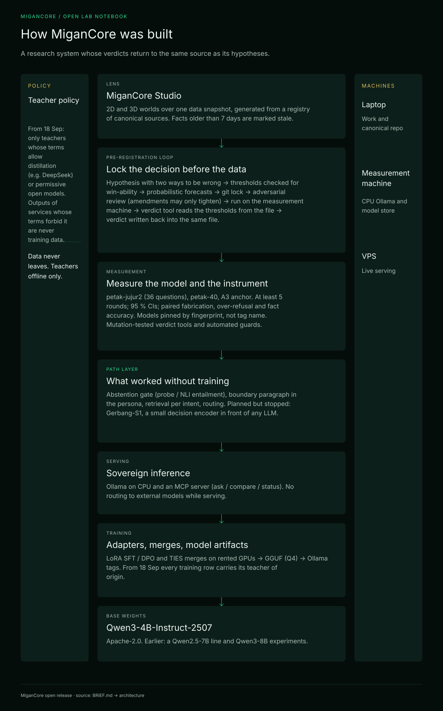
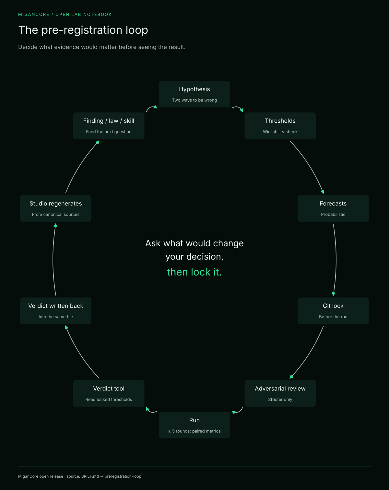

# Architecture

MiganCore was a small system with a large measurement apparatus around it. This page describes the layers
from the bottom up, with the rule each layer followed and where it lives in this repository.

## Layer 0 — Base weights

- **Qwen3-4B-Instruct-2507** (Apache-2.0) is the base of the served line.
- Earlier lines were a small 0.5B–3B family, a Qwen2.5-7B line in May 2026, and Qwen3-8B experiments. See the
  [lineage](lineage.md).
- **Rule: a model is identified by its fingerprint, not its tag.** A tag once pointed to the *Thinking*
  variant of the base while its name implied the *Instruct* variant (finding F-271). Every measurement since
  then records the model file's metadata and digest.

## Layer 1 — Training

- LoRA SFT, DPO and TIES merges ran on rented GPUs. Individual runs cost cents to a few dollars.
- Adapters are merged, converted to GGUF (Q4) and registered as Ollama tags (`migancore:*`).
- The served model **`migancore:0.14`** is a TIES merge of two "discipline" LoRAs on Qwen3-4B-Instruct-2507:
  arithmetic (a prompt-variety recipe, 285 rows) and style (200 rows).
- **Rule, adopted 18 Sep 2026: every training row carries its teacher of origin** (`_guru`). Allowed teachers
  are models whose terms explicitly allow distillation (e.g., DeepSeek) and permissive-license models that are
  silent on outputs. Outputs of commercial AI services whose terms forbid it are never training data. Earlier
  cycles did not follow this rule (see the lineage), and that history is recorded rather than hidden.

## Layer 2 — Serving

- **Ollama on CPU**, on a dedicated measurement machine and on a VPS.
- An **MCP server** exposes the model to agents with four tools: ask (grounded, with sources), compare
  (plain vs. with memory), status and agent.
- **Rule: sovereign serving.** No routing to external models while serving, and data never leaves the
  organization's server. Teachers are used only offline.

## Layer 3 — The path layer (what worked without training)

The path layer puts decisions *in front of* the model, so it works with any base.

| Component | What it does | Evidence |
|---|---|---|
| **Abstention ("trap") gate** | A probe model (the first-generation `migancore:0.4-qwen3`) judges whether a question is one the served model would answer by making things up; if so, the system abstains. It ran in shadow mode before it was switched on | GERBANG-ON: fabrication 52.2 % → 33.9 %, over-refusal 1.6 % |
| **Knowledge-boundary paragraph** | One paragraph in the persona that states what the character knows and what it does not | E2: out-of-scope fabrication 28.9 % → 8.9 %, p95 1.04 s |
| **Retrieval per intent** | Retrieves only for intents that need it | L2B / L2C experiments: mostly *not* wins, recorded as such |
| **Routing** | Sends a request to the right model or path | H-ARAH: routing carries the load under the locked rule |
| **Gerbang-S1** (planned, stopped) | A small decision encoder in front of any LLM | Stopped before lock, 28 Sep 2026 |

Law **C61** governs this layer: a gate helps in proportion to how much the base fabricates.

## Layer 4 — Measurement

- **Batteries:**
  - `petak-jujur2`, 36 questions in six categories: must-abstain and factual questions;
  - `petak-40`;
  - the **A3 anchor**.
- **Protocol:** at least 5 rounds, 95 % confidence intervals, and paired metrics (fabrication, over-refusal and
  fact accuracy) reported together.
- **A dedicated measurement machine.** A laptop is never a measurement machine; the health badge once checked
  the wrong machine.
- **Guards:** `node migan.mjs periksa` runs 123 automated checks and reports "healthy — safe to measure" only
  when all of them pass. The checks cover:
  - ratios cannot exceed 100 %;
  - verdicts cannot drift from their files;
  - tests cannot be orphaned;
  - mutation tests of the verdict tools must catch every mutant.

## Layer 5 — The pre-registration loop

1. **Hypothesis**, with two ways to be wrong.
2. **Metric**, with a ground truth the scorer never touched.
3. **Thresholds**, checked for win-ability, and **forecasts**.
4. **Lock**: a git commit, before any data file exists.
5. **Adversarial review** by another model. Amendments are dated and may only make winning harder.
6. **Run** on the measurement machine.
7. The **verdict tool** reads the thresholds from the locked file, refuses to compute early, and writes the
   verdict back into the same file.
8. The **Studio** regenerates its snapshot. The finding goes to the findings log, a law to the laws, and a
   reusable method to a skill.

`node migan.mjs status` prints every verdict directly from the 39 files in [`flywheel/`](../flywheel/).

## Layer 6 — The lens

[MiganCore Studio](studio.md) presents the evidence as a 2D and a 3D world, over one generated snapshot. The
Studio is a lens and never a store: every fact has exactly one canonical home, registered in
`studio/sumber-kebenaran.json` ("source of truth").

## The three machines

| Machine | Role |
|---|---|
| Laptop | Work, canonical repository, Studio server. Never used for measurement |
| Measurement machine | CPU Ollama; model, adapter and dataset store |
| VPS | Live serving for several projects. Read-only checks only |

## Where things live in this repository

See the repository map in the [README](../README.md#repository-map).
