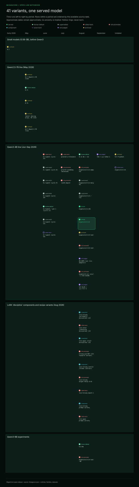

# Lineage — 41 model variants, one served model

> Generated by `tools/build-docs.mjs` from the files in [`data/`](../data/). Do not edit by hand.

Every variant that was trained, named or planned, from a small pre-Qwen3 family to the candidates that were never born. **A higher version number does not mean a better model**; the status comes from verdicts.

| # | Variant | Date | Base | Family | Status | Note |
|---|---|---|---|---|---|---|
| 1 | `0.1` | early 2026 (exact date not recorded) | Qwen2.5 / Qwen3 small (0.5B-3B) | Small models (0.5B-3B), before Qwen3 | **archived** | Small, cheap models abandoned for lack of capacity; no numbers attributable to this name. |
| 2 | `0.1-qwen3 (cycle 8)` | 2026-06-16 | Qwen3-4B-2507 | Qwen3-4B line (Jun-Sep 2026) | **superseded** | First 4B identity cycle: SFT LoRA r=64 on 379 pairs distilled from commercial AI services (~US$2.24). Qualitative evaluation only. |
| 3 | `0.2-qwen3 (cycle 9)` | 2026-06-17 | Qwen3-4B-Instruct-2507 | Qwen3-4B line (Jun-Sep 2026) | **superseded** | 807 pairs (537 new + 270 reused); distillation from commercial AI services, estimated at ~US$5-7 plus ~US$0.30; training cost US$0.21. 7/8 on a qualitative test; heavy over-use of tools. |
| 4 | `0.3 (Qwen2.5-7B line)` | ~May 2026 | Qwen2.5-7B | Qwen2.5-7B line (May 2026) | **archived** | Cycles 2-7 used ORPO/SimPO; most iterations of this line were rolled back (F-041). |
| 5 | `0.7c` | ~May 2026 | Qwen2.5-7B | Qwen2.5-7B line (May 2026) | **former-default** | Briefly the default, then replaced; archived. |
| 6 | `0.7e` | ~May 2026 | Qwen2.5-7B | Qwen2.5-7B line (May 2026) | **archived** | Not promoted permanently; archived. |
| 7 | `latest (moving alias, 7B line)` | ~May 2026 | Qwen2.5-7B | Qwen2.5-7B line (May 2026) | **archived** | A moving tag rather than a version; archived. |
| 8 | `0.8 (Qwen2.5-7B line)` | ~May 2026 | Qwen2.5-7B | Qwen2.5-7B line (May 2026) | **archived** | Not promoted permanently; archived. |
| 9 | `0.3-qwen3 (cycle 10)` | 2026-06-21 | Qwen3-4B-Instruct-2507 | Qwen3-4B line (Jun-Sep 2026) | **superseded** | PASS on its cycle gate, then replaced by 0.4-qwen3. |
| 10 | `0.4-qwen3 / gen-1 (cycle 11)` | 2026-06-23 | Qwen3-4B-Instruct-2507 | Qwen3-4B line (Jun-Sep 2026) | **former-default** | Promoted to production default; later kept as the cross-generation comparison anchor; replaced by migancore:0.14. |
| 11 | `0.5-qwen3 (cycle 12)` | late June 2026 | Qwen3-4B-Instruct-2507 | Qwen3-4B line (Jun-Sep 2026) | **rolled-back** | Rolled back; not promoted. |
| 12 | `0.6-qwen3 (cycle 13)` | 2026-06-30 | Qwen3-4B-Instruct-2507 | Qwen3-4B line (Jun-Sep 2026) | **superseded** | PASS as a recovery run, but did not replace 0.4 as default; archived. |
| 13 | `0.7-qwen3 (cycle 14)` | attempted 2026-06-30 | Qwen3-4B-Instruct-2507 (planned) | Qwen3-4B line (Jun-Sep 2026) | **never-born** | Postponed; the model was never produced. |
| 14 | `pilot14-irrelevance` | 2026-07-27 | Qwen3-4B-Instruct-2507 | Qwen3-4B line (Jun-Sep 2026) | **rolled-back** | QLoRA pilot to refuse irrelevant questions without hurting routing or general ability (197 irrelevance + 111 positive examples; one RTX 4090, 46.5 min, US$0.79). Rolled back. |
| 15 | `pilot15-seimbang (balanced)` | 2026-07-27 | Qwen3-4B-Instruct-2507 | Qwen3-4B line (Jun-Sep 2026) | **not-promoted** | PASS on the probe, but the decision record keeps it unpromoted; experiment archive. |
| 16 | `run16-2epoch` | 2026-07-27 | Qwen3-4B-Instruct-2507 | Qwen3-4B line (Jun-Sep 2026) | **not-promoted** | Not promoted; the result was within noise rather than a clear failure. |
| 17 | `0.5-flywheel` | not recorded | Qwen3-4B-Instruct-2507 | Qwen3-4B line (Jun-Sep 2026) | **archived** | Artifact of the data-flywheel experiments; never formally promoted. |
| 18 | `0.8-8b` | ~2026-08-20 | Qwen3-8B | Qwen3-8B experiments | **former-default** | Served for a while behind grounding/MCP, then replaced; archived. |
| 19 | `0.11-4b / v11` | 2026-08-21/22 | Qwen3-4B-Instruct-2507 | Qwen3-4B line (Jun-Sep 2026) | **former-default** | Production/comparison model for a short time; replaced by v13 and then v14. |
| 20 | `migancore:0.12-adapter` | 2026-08-22 | Qwen3-4B-Instruct-2507 | Qwen3-4B line (Jun-Sep 2026) | **not-promoted** | Weak link in the evidence chain; barred as a basis for claims or promotion. |
| 21 | `migancore:0.12-merged` | 2026-08-22 | Qwen3-4B-Instruct-2507 + merged v12 LoRA | Qwen3-4B line (Jun-Sep 2026) | **superseded** | A healthy merge proved the runtime was not the only problem; the one-pot recipe failed and the v12 line was stopped. |
| 22 | `migancore:0.13 / v13` | 2026-08-22 | Qwen3-4B-Instruct-2507 | Qwen3-4B line (Jun-Sep 2026) | **superseded** | Adjudicated on 10 Sep as PARTIAL PASS; replaced by v14. |
| 22a | `lora-hitung (arithmetic discipline) v13` | 2026-08-22 | Qwen3-4B-Instruct-2507 | LoRA 'discipline' components and recipe variants (Aug 2026) | **component** | Component of v13; replaced in v14 by the prompt-variety arithmetic adapter. |
| 22b | `lora-nalar (reasoning discipline) v13` | 2026-08-22 | Qwen3-4B-Instruct-2507 | LoRA 'discipline' components and recipe variants (Aug 2026) | **rolled-back** | Harmful; removed from the v14 merge. |
| 22c | `lora-gaya (style discipline) v13` | 2026-08-22 | Qwen3-4B-Instruct-2507 | LoRA 'discipline' components and recipe variants (Aug 2026) | **component** | Kept: the original v13 style adapter is part of the v14 merge. |
| 22d | `lora-hitung control (format contract)` | 2026-08-23 | Qwen3-4B | LoRA 'discipline' components and recipe variants (Aug 2026) | **component** | PASS as a control arm; not a production candidate. |
| 22e | `lora-hitung weight-decay 0.01` | 2026-08-23 | Qwen3-4B | LoRA 'discipline' components and recipe variants (Aug 2026) | **not-promoted** | PASS without a win = inert; the weight-decay path was closed. |
| 22f | `lora-hitung epoch-1` | 2026-08-23 | Qwen3-4B | LoRA 'discipline' components and recipe variants (Aug 2026) | **rolled-back** | FAIL; the recipe-dial path was closed and the next lever became prompt variety. |
| 22g | `lora-hitung prompt-variety` | 2026-08-23 | Qwen3-4B | LoRA 'discipline' components and recipe variants (Aug 2026) | **component** | PASS and WIN: became the default v14 data recipe and a component of 0.14k/0.14. |
| 22h | `lora-gaya prompt-variety` | 2026-08-23 | Qwen3-4B | LoRA 'discipline' components and recipe variants (Aug 2026) | **rolled-back** | FAIL; not merged, v14 used the original v13 style adapter. |
| 23 | `hitung-ajar364 (v13 research variant)` | 2026-08-22/24 | Qwen3-4B-Instruct-2507 | LoRA 'discipline' components and recipe variants (Aug 2026) | **not-promoted** | Reported as passing, but a one-row gold-label defect limits the claim; not promoted. |
| 24 | `migancore:0.14k` | 2026-08-24 | Qwen3-4B-Instruct-2507 | Qwen3-4B line (Jun-Sep 2026) | **served** | PASS on the local tier-2 gate; same weights as migancore:0.14 (alias). |
| 25 | `migancore:0.14` | served from 2026-08-24 | Qwen3-4B-Instruct-2507 | Qwen3-4B line (Jun-Sep 2026) | **served** | TIES-merge of the arithmetic (prompt-variety, 285 rows) and style (200 rows) LoRAs. About 50% fabrication on the petak-jujur2 battery (49.9% mean over 40 valid rounds); kept in service because the v15 and v16 candidates failed promotion. |
| 26 | `migancore:0.14-tool` | 2026-08-24/25 | 0.14 (4B) + tool adapter | Qwen3-4B line (Jun-Sep 2026) | **archived** | Tool-use specialist branch; never replaced 0.14. |
| 27 | `migancore:0.14-tool-8b` | 2026-08-25 | Qwen3-8B | Qwen3-8B experiments | **not-promoted** | Missed the tool threshold and was poor on hallucination; research archive, barred from promotion. |
| 28 | `migancore:0.15-tool` | 2026-08-28 | 0.14 tool branch (4B) | Qwen3-4B line (Jun-Sep 2026) | **not-promoted** | Early PASS revoked on 30 Aug: FAIL on the regression gate (fabrication 8.4/14 mean over 5 rounds vs <= 8), despite 113/120 on the tool gate. |
| 29 | `migancore:uji-jujur-1 (V16-JUJUR)` | 2026-08-31 | Qwen3-4B-Instruct-2507 | Qwen3-4B line (Jun-Sep 2026) | **not-promoted** | NOT A WIN: 60.0% fabrication vs the <= 50% win threshold, statistically indistinguishable from 0.14; archived. |
| 30 | `migancore:0.16` | never produced | - | Qwen3-4B line (Jun-Sep 2026) | **never-born** | Name reserved for a V16 or V18 promotion that never happened. |
| 31 | `V17-RLVR / uji-rlvr-1` | 2026-08-31 to 09-01 | Qwen3-4B + style adapter | Qwen3-4B line (Jun-Sep 2026) | **not-judged** | GPU budget ran out at 71% of the merge; the RLVR adapter exists but was never evaluated. |
| 32 | `MO-GRPO runs (six adapters)` | pre-registered 2026-08-28 | v14/v15 tool branch | Qwen3-4B line (Jun-Sep 2026) | **not-judged** | None of the six adapters was ever measured, so the main question cannot be judged. |
| 33 | `V18 / uji-tahan-1` | pre-registered 2026-09-07 | Qwen3-4B-Instruct-2507 (planned) | Qwen3-4B line (Jun-Sep 2026) | **not-judged** | Never run; therefore never judged and never called 0.16. |

### Status legend

- **served** — Served model (the one in production at closure)
- **former-default** — Was the default/production model at some point, later replaced
- **superseded** — Replaced by a later version
- **rolled-back** — Rolled back after evaluation
- **not-promoted** — Measured and explicitly barred from promotion
- **component** — Building block of a merged model, not served on its own
- **never-born** — Planned or named, but the model was never produced
- **not-judged** — Trained or pre-registered, but never measured to a verdict
- **archived** — Archived without a formal verdict

## Per-variant detail

Long fields come from the lineage reference (goal, data and method, measurement, verdict).

### 1. `0.1`

- **Date and base:** Detailed dates are absent from the source; the `0.1 / 0.1-qwen3` family is summarized as small 0.5B–3B models based on Qwen2.5/Qwen3, while the name `0.1` is not assigned a more specific base.
- **Goal:** Pursue a small, inexpensive model, but its capacity was judged insufficient for subsequent needs.
- **Data, method, cost:** Absent from the source for `0.1` as a separate variant.
- **Measured:** No figures can be attributed specifically to `0.1`; cycle-8 figures are recorded separately under `0.1-qwen3`.
- **Verdict / status:** Abandoned/archived because of capacity; not the served model.

### 2. `0.1-qwen3 (cycle 8)`

- **Date and base:** 16 June 2026; `Qwen3-4B-2507`.
- **Goal:** Instill MiganCore identity and basic capabilities in the initial leap to 4B.
- **Data, method, cost:** SFT LoRA `r=64`, `alpha=64`; 379 pairs on identity, creator, coding, cognition, and innovation, distilled from commercial AI services. Four cycles/retries reportedly cost around US$2.24; the training location is not explicitly stated in the version section.
- **Measured:** Qualitative identity evaluation changed from Qwen answers to MiganCore identity in Indonesian/English/Chinese; no standard test battery scores.
- **Verdict / status:** Used as the start of the 4B lineage, then replaced by subsequent cycles; no longer the served model.

### 3. `0.2-qwen3 (cycle 9)`

- **Date and base:** 17 June 2026; `Qwen3-4B-Instruct-2507`.
- **Goal:** Expand identity/capabilities with new data without forgetting cycle8.
- **Data, method, cost:** Response-only SFT LoRA `r=64`, `alpha=64`, `lr=2e-4`, 3 epochs; 807 pairs, consisting of 537 new and 270 reused. Training cost US$0.21; estimated distillation cost from commercial AI services US$5–7 and around US$0.30; training infrastructure is not explicitly stated in this section.
- **Measured:** 7/8 on qualitative testing; inline identity testing recorded 0 false negatives, but excessive tool use was described as severe. This is not petak-40, petak-jujur2, or the modern tool gate.
- **Verdict / status:** Replaced by `0.3-qwen3`; not currently served.

### 4. `0.3 (Qwen2.5-7B line)`

- **Date and base:** Around May 2026; `Qwen2.5-7B`.
- **Goal:** Early 7B iteration; the specific goal for `0.3` is absent from the source.
- **Data, method, cost:** This family used cycles 2–7 with ORPO/SimPO; size, composition, infrastructure, and costs specific to `0.3` are absent from the source.
- **Measured:** No figures can be attributed specifically to `0.3`.
- **Verdict / status:** Most iterations of the old family were rolled back; `0.3` has no record of permanent promotion and is now archived.

### 5. `0.7c`

- **Date and base:** Around May 2026; `Qwen2.5-7B`.
- **Goal:** Absent from the source for this variant.
- **Data, method, cost:** Part of ORPO/SimPO cycles 2–7; specific details are absent from the source.
- **Measured:** No specific figures.
- **Verdict / status:** Briefly became the default, then was replaced; now archived and not the served model.

### 6. `0.7e`

- **Date and base:** Around May 2026; `Qwen2.5-7B`.
- **Goal:** Absent from the source.
- **Data, method, cost:** ORPO/SimPO cycles 2–7; no variant details.
- **Measured:** Absent from the source.
- **Verdict / status:** Part of the lineage that was not permanently promoted; archived.

### 7. `latest (moving alias, 7B line)`

- **Date and base:** Around May 2026; `Qwen2.5-7B`.
- **Goal:** Absent from the source; `latest` is a name that retains no experimental meaning.
- **Data, method, cost:** Related to ORPO/SimPO cycles 2–7; no details.
- **Measured:** No specific figures.
- **Verdict / status:** Not permanently promoted; this moving name is now archived.

### 8. `0.8 (Qwen2.5-7B line)`

- **Date and base:** Around May 2026; `Qwen2.5-7B`.
- **Goal:** Absent from the source for `0.8` without the `-8b` suffix.
- **Data, method, cost:** Related to ORPO/SimPO cycles 2–7; no specific details.
- **Measured:** No specific figures; do not conflate with `0.8-8b`.
- **Verdict / status:** Not permanently promoted; archived.

### 9. `0.3-qwen3 (cycle 10)`

- **Date and base:** 21 June 2026; `Qwen3-4B-Instruct-2507`.
- **Goal:** Improve excessive tool use, cross-turn memory, and hallucination without damaging identity.
- **Data, method, cost:** SFT LoRA `r=64`, `alpha=64`, `lr=2e-4`, 3 epochs; 1,794 pairs, namely 807 old + 987 new. Training cost US$0.15; estimated distillation cost from commercial AI services around US$7 + US$0.50; infrastructure is not explicitly stated in this section.
- **Measured:** On `eval_3axis`, identity 0.88→0.88, abstention 1.00, excessive tool use 0.71→1.00, memory 0→0.75, and hallucination 0.86→0.92; this instrument is not petak-40/petak-jujur2.
- **Verdict / status:** `PASS`, then replaced by `0.4-qwen3`; no longer the served model.

### 10. `0.4-qwen3 / gen-1 (cycle 11)`

- **Date and base:** Trained 23 June 2026 from `Qwen3-4B-Instruct-2507`; SANAD (chain-of-evidence record) written 10 September 2026.
- **Goal:** Cumulative SFT with greater emphasis on behavior to become the first production generation with a strong persona.
- **Data, method, cost:** SFT LoRA `r=64`, `alpha=64`, `lr=2e-4`, 3 epochs; 2,063 rows total, 1,851 train + 206 eval. Vast RTX 3090 Ti, 21.4 minutes, around US$0.13.
- **Measured:** Old gates: memory without context 0/4, with memory 8/8, false premise 4/4, out of scope 4/4. On **petak-jujur2 36 questions**, 24.6% fabrication was later recorded, CI 95% 19.9–29.2, n=8; with the gate it became 13.1%. The `gen-1` probe has recall 82.1%. These figures are not mixed with **petak-40** or the tool gate.
- **Verdict / status:** Previously promoted as the production default; now the comparison baseline and replaced by `migancore:0.14`. Three links in the old SANAD (chain-of-evidence record) were rated `dhaif` (weak, unreliable links), so broad performance claims are not automatically inherited.

### 11. `0.5-qwen3 (cycle 12)`

- **Date and base:** Late June 2026 (`2026-06-2x` in the changelog); `Qwen3-4B-Instruct-2507`.
- **Goal:** Add organic/flywheel data on top of 0.4 while maintaining the gates.
- **Data, method, cost:** SFT LoRA `r=64`, `alpha=64`, `lr=2e-4`, 3 epochs; around 1,944 train + 216 eval. Vast, 27.7 minutes, around US$1.38. Of 58 organic examples, 22 used self-distilled `chosen` answers, later identified as the root cause of the regression.
- **Measured:** On the cycle gates at the time, hallucination 0.94→0.84, tools 0.92→0.79, reasoning 1.00→0.75, and irrelevance 0.50; this is not petak-40/petak-jujur2.
- **Verdict / status:** **ROLLBACK**, not promoted.

### 12. `0.6-qwen3 (cycle 13)`

- **Date and base:** 30 June 2026; `Qwen3-4B-Instruct-2507`.
- **Goal:** Fix the 0.5 regression by removing self-distillation data and reducing training pressure.
- **Data, method, cost:** SFT LoRA; 22 self-chosen examples removed, gold duplication reduced `×2→×1`, epochs `3→2`; final data 2,197 rows including 75 target examples. Vast; exact cost is absent from the source.
- **Measured:** Reported as matching 0.4 and held-out 1.00 on the cycle gates; item counts/CIs are absent, so it must not be equated with modern test batteries.
- **Verdict / status:** `PASS` as a recovery, but did not replace 0.4 as the default; now archived.

### 13. `0.7-qwen3 (cycle 14)`

- **Date and base:** Attempted 30 June 2026; planned base from the `Qwen3-4B-Instruct-2507` lineage.
- **Goal:** Use elite teacher data to improve on cycle13 quality.
- **Data, method, cost:** Planned SFT; three Vast attempts failed because of installation timeouts/SSH boot. Total cost around US$0.14; recipe/script reportedly ready, but the model run did not finish.
- **Measured:** None—the model was never completed.
- **Verdict / status:** Postponed; the model was never born and was not promoted.

### 14. `pilot14-irrelevance`

- **Date and base:** 27 July 2026; `Qwen3-4B-Instruct-2507`.
- **Goal:** Increase refusal of irrelevant questions without damaging routing and general capabilities.
- **Data, method, cost:** SFT QLoRA `r=64`, `alpha=64`, `lr=2e-4`, 3 epochs, seq 1024, NF4 then Q4; 197 irrelevance examples + 111 positive examples, around 10% of the mixture, 501 steps. Vast RTX 4090, 46.5 minutes, US$0.786.
- **Measured:** On the 207-item probe, irrelevance 38/60→60/60 (`p=0`), routing 52→42 (`p=0.002`), aggregate +22/−14 (`p=0.243`). Subsequent analysis corrected the earlier claim of reasoning regression as not significant and found poisoned labels. This is a pilot probe, not petak-40/petak-jujur2.
- **Verdict / status:** **ROLLBACK**; not promoted.

### 15. `pilot15-seimbang (balanced)`

- **Date and base:** 27 July 2026; `Qwen3-4B-Instruct-2507`.
- **Goal:** Improve the pilot14 trade-off with a more balanced tool-positive:irrelevance mixture.
- **Data, method, cost:** The same 3-epoch pilot recipe; 174 irrelevance examples + 235 tool-positive examples, ratio 1.35:1. Vast; cost US$0.58.
- **Measured:** 207-item pilot probe: irrelevance 60/60, routing 42→51, simple 9→11, aggregate +22/−4, `p=0.0005`; not a modern test battery.
- **Verdict / status:** `PASS` on the probe, but the decision records no promotion; experimental archive.

### 16. `run16-2epoch`

- **Date and base:** 27 July 2026; same base as pilot15, `Qwen3-4B-Instruct-2507`.
- **Goal:** Test whether 2 epochs preserve the benefits of the pilot15 mixture with less overfitting risk.
- **Data, method, cost:** Same data as pilot15; one main change, `3→2` epochs, 338 steps. Vast; cost US$0.47.
- **Measured:** On the 207-item probe, +2/−3 (`p=1`) and routing 52/52; comparison of 40 probes against pilot15 yielded +3/−3 (`p=1`). The initial rollback verdict was later judged a harness artifact; this instrument is not the similarly named petak-40, but 40 pilot comparison probes.
- **Verdict / status:** Not promoted; the final result is treated as equivalent within noise, not a clear model failure.

### 17. `0.5-flywheel`

- **Date and base:** Detailed training date is absent from the source; base `Qwen3-4B-Instruct-2507`.
- **Goal:** Prove the own-data flywheel with tiered curation, not become an automatic replacement for the served model.
- **Data, method, cost:** SFT LoRA on 8,229 GOLD rows from the data estate, curated in three layers. Kaggle T4×2 for 350 minutes, cost Rp0; loss 1.078. Lightweight backup around 2.5 GB. Refusal:answer ratio is absent from the source.
- **Measured:** The old headline of 10/14 on the hallucination test battery was corrected in the V14 document; that instrument is not petak-jujur2. The corrected figure attributable to 0.5-flywheel is not explicitly stated, so it is not copied.
- **Verdict / status:** Flywheel/experimental artifact; not recorded as a served model or formal promotion.

### 18. `0.8-8b`

- **Date and base:** Around 20 August 2026; `Qwen3-8B`.
- **Goal:** Test 8B capacity for tool discipline and use behind grounding.
- **Data, method, cost:** LoRA on Qwen3-8B; v10 dataset composed of around 94% answering and 6% refusing. Trained on a rented RTX 3090 at a cost of US$1.29; loss 0.936. Epoch/rank details are absent from the source section tied to this name.
- **Measured:** **Old tool test**: call 5/6, do-not-call 5/5, missing tool 4/4, `LULUS`; comparators 0.4 and 0.5 failed. The old hallucination test battery initially gave 10/14, then instrument correction gave 6/14. This is not petak-jujur2.
- **Verdict / status:** Previously a production model behind grounding/MCP, then replaced; now archived and not the served model.

### 19. `0.11-4b / v11`

- **Date and base:** 21–22 August 2026; `Qwen3-4B-Instruct-2507`.
- **Goal:** One-pot 4B with a “facts only” prompt as a production/comparison model.
- **Data, method, cost:** One-pot SFT, 1,482 rows; rank, epochs, infrastructure, costs, and refusal:answer ratio are absent from the source tied to v11.
- **Measured:** The v13 gate records the comparator at 55/60 on arithmetic. Full evaluation on 23 August: arithmetic 24/30 + 26/30, tools 78/90, reasoning 31/42, old hallucination 6/14; identity sometimes mentions Fahmi's Qwen. All are old pre-C38 instruments.
- **Verdict / status:** Previously production/comparator; replaced by v13 then v14 and now archived.

### 20. `migancore:0.12-adapter`

- **Date and base:** 22 August 2026; `Qwen3-4B-Instruct-2507`.
- **Goal:** Package the v12 LoRA directly into the Ollama runtime as a lightweight path.
- **Data, method, cost:** LoRA `r=16`, `alpha=32`, 2 epochs, prompt masking; curated dataset of 1,351 rows. Vast run-6, loss 1.4256, 17.6 minutes, response token coverage 52.2%; cost absent from SANAD (chain-of-evidence record).
- **Measured:** The adapter-GGUF runtime produced corrupted output with figures 48/38 in the gate record; the source states the adapter route was faulty, so the figures are not evidence of weights quality.
- **Verdict / status:** A `dhaif` (weak, unreliable) link; barred from serving as the basis for claims/promotion.

### 21. `migancore:0.12-merged`

- **Date and base:** 22 August 2026; v12 LoRA merged into `Qwen3-4B-Instruct-2507`.
- **Goal:** Provide a sound comparator to determine whether the failure came from the adapter runtime or the one-pot recipe.
- **Data, method, cost:** Same data and LoRA as 0.12-adapter—1,351 rows, `r=16`, `alpha=32`, 2 epochs—then merge and GGUF; merge cost absent.
- **Measured:** ton-dengan 6/12 (failed threshold 8), ton-tanpa 12/12, total 41/60 (68%), difference −22 against v11 on the SANAD (chain-of-evidence record) gate; not petak-40/petak-jujur2.
- **Verdict / status:** The sound merge proves the runtime was not the only problem; the one-pot recipe failed and the v12 lineage was stopped. V11 remained in use at the time.

### 22. `migancore:0.13 / v13`

- **Date and base:** 22 August 2026; `Qwen3-4B-Instruct-2507`.
- **Goal:** Replace one-pot with three discipline-specific LoRAs, then TIES-merge, so arithmetic, reasoning, and style can be controlled.
- **Data, method, cost:** TIES on adapters for arithmetic 283 rows, reasoning 314, style 200; 554 RAG rows excluded. Training on Vast 3×RTX 3090, respective losses 0.946/1.706/1.698; exact cost absent.
- **Measured:** Initial gates: arithmetic 60/60 and 58/60, refusal 9/10, canary 0/12. Evaluation on 23 August: tools 67/90, reasoning 24/42 vs base with `p=0.0117`, old hallucination initially 10/14 then corrected to 9/14; analogy failed. These old instruments are not equivalent to petak-jujur2.
- **Verdict / status:** SANAD (chain-of-evidence record) says `LULUS (PASS) R0.3`; adjudication on 10 September says `LULUS SEBAGIAN` because the initial formal verdict was never written and the protocol is obsolete. Replaced by v14.

### 22a. `lora-hitung (arithmetic discipline) v13`

- **Date and base:** 22 August 2026; arithmetic-discipline LoRA on `Qwen3-4B-Instruct-2507`.
- **Goal:** “The arithmetic adapter alone fixes ton without colonizing its neighbors.”
- **Data, method, cost:** 283 rows, cluster LoRA with the v13 recipe; Vast RTX 3090, loss 0.946. Adapter-specific rank/alpha/cost absent from SANAD (chain-of-evidence record).
- **Measured:** The v13 adapter/merge achieved arithmetic up to 60/60, but component evaluation used the old tier-1 gate; complete per-item solo results are absent from the condensed corpus.
- **Verdict / status:** Used as a v13 component, then replaced by `hitung-promptragam` in v14; not a separately served model.

### 22b. `lora-nalar (reasoning discipline) v13`

- **Date and base:** 22 August 2026; reasoning-discipline LoRA on `Qwen3-4B-Instruct-2507`.
- **Goal:** Improve analogy without damaging the base's arithmetic.
- **Data, method, cost:** 314 rows; Vast RTX 3090, loss 1.706; specific cost absent.
- **Measured:** In the full v13 evaluation, reasoning 24/42 fell from the base's 33/42, paired McNemar `p=0.0117`; false premise 0/4.
- **Verdict / status:** Harmful; excluded from the v14 merge and not promoted.

### 22c. `lora-gaya (style discipline) v13`

- **Date and base:** 22 August 2026; style-discipline LoRA on `Qwen3-4B-Instruct-2507`.
- **Goal:** Enforce role boundaries without damaging arithmetic.
- **Data, method, cost:** 200 rows; Vast RTX 3090, loss 1.698; specific cost absent.
- **Measured:** Comparator recorded before the varied-prompt variant: arithmetic 10/10 and 10/10, tolak-ringkas 10/10, canary 0/12; old tier-1 instrument.
- **Verdict / status:** Passed as a component; original v13 style used in the v14 merge after gaya-promptragam failed. Not a separately served model.

### 22d. `lora-hitung control (format contract)`

- **Date and base:** 23 August 2026; v13 arithmetic adapter on Qwen3 4B with a format-2 I/O contract.
- **Goal:** Reproduce the arithmetic adapter with the patched pipeline to serve as an equivalent comparator for ablation.
- **Data, method, cost:** 285 rows (=283+2 teaching examples), identical v13 recipe; Vast, US$0.02, 9 minutes; loss 0.918.
- **Measured:** Passed 10/10 clauses; tier-1 10/10 and 8/10, petak-tahan loss base 3.665→adapter 2.461.
- **Verdict / status:** **LULUS (PASS)** as a control; not a production candidate.

### 22e. `lora-hitung weight-decay 0.01`

- **Date and base:** 23 August 2026; Qwen3 4B arithmetic adapter variant.
- **Goal:** Weight decay 0.01 was expected to reduce colonization/memorization without eroding arithmetic.
- **Data, method, cost:** Same data/recipe as the control, one change `weight_decay=0.01`; Vast. Specific cost not separated; total for the night's three runs US$0.13.
- **Measured:** Identical to control; arithmetic did not decline, ton 4/4, canary 0/12, petak-tahan within tolerance. Calculated shrinkage effect only 0.007%.
- **Verdict / status:** **LULUS (PASS) without a win = INERT**; wd 0.1 canceled and the path closed.

### 22f. `lora-hitung epoch-1`

- **Date and base:** 23 August 2026; Qwen3 4B arithmetic adapter variant.
- **Goal:** 1 epoch was expected to suffice to instill ton with less memorization.
- **Data, method, cost:** Same data/recipe as the control; only epochs `2→1`; Vast. Specific cost not separated from the night's total US$0.13.
- **Measured:** Arithmetic “with” 8/10 failed the threshold, but the “training” arm scored 10/10; sensitivity shifted across prompts rather than disappearing.
- **Verdict / status:** **GAGAL (FAIL)**; epoch 1 and the recipe-dial path closed, the next lever is varied-prompt data.

### 22g. `lora-hitung prompt-variety`

- **Date and base:** 23 August 2026; Qwen3 4B arithmetic adapter.
- **Goal:** Rotating the system prompt on the same arithmetic data was expected to eliminate dependence on the prompt/framework.
- **Data, method, cost:** 285 rows, A31/G27/P18/N25 rotation, answers/questions/order unchanged; identical v13 recipe, Vast RTX 3090 Ti format-2. Specific cost absent.
- **Measured:** Tier-1 10/10·10/10·10/10 and average 2/2 on all arms.
- **Verdict / status:** **LULUS (PASS) + MENANG**; became the default v14 data recipe and a component of 0.14k/0.14.

### 22h. `lora-gaya prompt-variety`

- **Date and base:** 23 August 2026; Qwen3 4B style adapter.
- **Goal:** Prompt rotation on 200 style rows was expected to maintain role boundaries without damaging arithmetic.
- **Data, method, cost:** 200 rows, 30 with tool lists; identical v13 recipe, only the system prompt rotated. Vast; specific cost absent.
- **Measured:** arit-dengan 7/10 and ton 2/4; arit-tanpa 9/10 and ton 4/4; tolak-ringkas 8/10; canary 0/12.
- **Verdict / status:** **GAGAL (FAIL)**; excluded from the v14 merge, which uses original v13 style.

### 23. `hitung-ajar364 (v13 research variant)`

- **Date and base:** 22–24 August 2026; `Qwen3-4B-Instruct-2507` lineage.
- **Goal:** Test whether additional arithmetic teaching improves results with/without context.
- **Data, method, cost:** Arithmetic-cluster LoRA, 364 rows = 285 v13 + 79 manual gold; recipe identical to v13. Vast, 7.4 minutes, US$0.03, loss 0.384. A post-run audit found one defective gold row `×1000`; dataset corrected 364→363, but the adapter was not retrained.
- **Measured:** `LULUS + MENANG DOBEL`: with 10/10 (average 2/2), without 10/10 vs control 8/10, training arm 9/10 (average 1/2) vs control 8/10 (0/2), canary 0/12, petak-tahan −1.192; pre-v14 mini instrument, not a modern test battery.
- **Verdict / status:** Experimental result declared a pass, but the defective gold row limits the strength of the claim; not recorded as a separate production model.

### 24. `migancore:0.14k`

- **Date and base:** 24 August 2026; `Qwen3-4B-Instruct-2507`.
- **Goal:** TIES-merge the varied-prompt arithmetic adapter + style, deliberately excluding the reasoning adapter proven harmful.
- **Data, method, cost:** Varied-prompt arithmetic 285 rows with A31/G27/P18/N25 prompt rotation + style 200 rows; TIES-merge. Arithmetic adapter trained on Vast RTX 3090 Ti; specific actual cost absent from SANAD (chain-of-evidence record).
- **Measured:** Old tier-2 gates: arithmetic 60/60 and 59/60, refusal 10/10, canary 0/12, reasoning 29/42, old hallucination 7/14 then corrected to 6/14, tools 79/90, analogy 40/62 failed. This is not petak-jujur2.
- **Verdict / status:** `LULUS (PASS) H-v14k-tier2-lokal`; an alias for the same weights as `migancore:0.14`, which is currently served.

### 25. `migancore:0.14`

- **Date and base:** Served since 24 August 2026; weights alias `0.14k`, derived from `Qwen3-4B-Instruct-2507`.
- **Goal:** Become a general model merged from arithmetic+style without the harmful reasoning adapter.
- **Data, method, cost:** Same as 0.14k: TIES-merge LoRA varied-prompt arithmetic 285 + style 200; actual cost absent from the source.
- **Measured:** Historical old tier-2: arithmetic 60/59, refusal 10/10, reasoning 29/42, corrected old hallucination 6/14, tools 79/90. On **petak-jujur2 36 questions**, H4 gives 50.0% fabrication, CI 95% 46.8–53.1, n=13. On **petak-40**, 55.5% was previously recorded; figures are not pooled because the instruments differ.
- **Verdict / status:** **BERLAKU (SERVED)**; remains served because candidates v15 and v16 failed promotion.

### 26. `migancore:0.14-tool`

- **Date and base:** Branch of 24–25 August 2026; adapter on the v14/4B base.
- **Goal:** A tool-specialist branch, not a successor to the general model.
- **Data, method, cost:** Tool-cluster LoRA; final SANAD (chain-of-evidence record) records 389 rows, `r=16`, `alpha=32` on the 4B base. Runs 1–7 changed data/prompts; total costs per run are not summarized. Training on Vast, packaging/evaluation locally/on VPS.
- **Measured:** run-3 was once best on the **old tool test**, 91/120; run-7 86/120 and run-6 81/120. The run-3 hallucination headline `2/14` was an old-instrument result corrected to 4/14. On **petak-jujur2 36 questions**, H4 later recorded 26.8%, CI 95% 24.1–29.5, n=6, but the 600-second timeout differs from 0.14's 120 seconds, limiting direct comparison.
- **Verdict / status:** Specialist branch; never replaced 0.14 and now archived/a special-purpose service, not the served model. No separate final promotion pre-registration in BERLAKU (SERVED).

### 27. `migancore:0.14-tool-8b`

- **Date and base:** 25 August 2026; `Qwen3-8B`.
- **Goal:** Test whether 8B capacity clears the tool gate with the same tool data/recipe.
- **Data, method, cost:** 201 rows of run-7 data, same LoRA recipe except for the 8B base. Trained on Vast; creation/serving moved to VPS because of disk constraints. Exact cost absent.
- **Measured:** On the **old tool test**, 8B baseline 87/120 and candidate 97/120, failed threshold 99; missing-tool category 7/20. Old regression gates: arithmetic 60/60, refusal 9/10, canary 0/12; hallucination initially 13/14 then corrected to 12/14. The server record of 12,224 seconds per response was later corrected as a hardware problem; the laptop reached 18.6 tok/s, VPS CPU around 0.016 tok/s.
- **Verdict / status:** Failed the tool threshold and performed poorly on hallucination; research archive, **barred from promotion**.

### 28. `migancore:0.15-tool`

- **Date and base:** 28 August 2026; 4B base from the v14 tool branch.
- **Goal:** Test whether a larger volume of tool data increases tool success without damaging regression gates.
- **Data, method, cost:** LoRA `r=16`; 389 rows = 201 old + 188 distilled. The claimed change is volume only, 201→389. Budget locked at training ≤US$0.10 and packaging ≤US$0.05; actual cost absent.
- **Measured:** **V15 tool gate** 113/120 vs v14-tool 87 and base 80; regression arithmetic 60/60, refusal 10/10, canary 0/12; **TAHAN test battery** 23/24. On the old hallucination test battery, five rounds = 8, 9, 7, 8, 10; mean 8.4/14 (60%), failed threshold ≤8.
- **Verdict / status:** Initial pass verdict revoked 30 August; final **GAGAL (FAIL) regression gate**, **barred from promotion**.

### 29. `migancore:uji-jujur-1 (V16-JUJUR)`

- **Date and base:** 31 August 2026; `Qwen3-4B-Instruct-2507`.
- **Goal:** Reduce the tendency to fabricate with 33 handwritten honesty gold examples, without damaging arithmetic/tools; the name `0.16` is assigned only upon a win.
- **Data, method, cost:** TIES-merge varied-prompt arithmetic 285 + gaya-jujur1 233 (=200 v13 style + 33 gold); style LoRA `r=16`, `alpha=32`, `lr=2e-4`, 2 epochs. Vast RTX 3090: training 13 minutes/US$0.04, merge 51 minutes/US$0.16.
- **Measured:** **petak-40**: candidate 60.0% vs 0.14 55.5%, Welch `t=1.62`, not significant; factual score 10.2 vs 11.2. **Regression gates**: arithmetic 59/60, refusal 10/10, canary 0/12; **current tool gate** 19/24 vs 18/24. All gates passed, but the MENANG fabrication threshold ≤50% failed.
- **Verdict / status:** **TIDAK MENANG (NOT A WIN)**; archived, barred from promotion; `migancore:0.14` remains served.

### 30. `migancore:0.16`

- **Date and base:** Never born; name reserved for V16 promotion or the V18 path on 4B.
- **Goal:** Become the next release name only if the candidate passes all promotion conditions.
- **Data, method, cost:** None, because the release name was never assigned.
- **Measured:** None for a model named `0.16`; V16 candidate results are recorded under `uji-jujur-1`, while V18 has not been run.
- **Verdict / status:** No model yet; not served, not a weights archive, and cannot yet be judged as a version.

### 31. `V17-RLVR / uji-rlvr-1`

- **Date and base:** 31 August–1 September 2026; Qwen3 4B base with a style adapter, then RLVR/MO-GRPO.
- **Goal:** Teach honesty through verifiable rewards, then test whether petak-40 improves without regression.
- **Data, method, cost:** Pool of 36 prompts: 10 “nonexistent”, 8 false premises, 6 out of scope, 12 factual questions. MO-GRPO LoRA `r=16`, `alpha=32`, `lr=5e-6`, 8 generations, temperature 0.8, beta 0.04; length trimmed 256→128 and accumulation adjusted during the run. Vast; total cost US$1.96.
- **Measured:** 20 training steps completed and adapter delta +7.19 reported; merge stopped at 71% because credit ran out. No post-training petak-40, petak-jujur2, tool gate, or regression gate.
- **Verdict / status:** **BELUM DIVONIS (NOT YET JUDGED)**; hypothesis remains open and promotion is prohibited.

### 32. `MO-GRPO runs (six adapters)`

- **Date and base:** Pre-registration 28 August 2026; v14/v15 tool base according to adapter name.
- **Goal:** Assess whether MO-GRPO can optimize tools/honesty with multiple rewards; the sub-goal is to see which objectives actually produce gradients.
- **Data, method, cost:** Pool of 361 prompts; MO-GRPO with a locked budget ≤US$0.50. Six artifacts: `lora-gaya-rlvr1` (20 steps/5,760 rollouts), `tool-grpo-diag` (3/768), `diag2` (2/512), `jujur-probe` (2/128), `jujur` (20/5,760), `waktu` (3/768). Vast infrastructure; actual costs per run absent.
- **Measured:** In the training logs, repeatedly active objectives are takUlang 61.8–68.8% and jujur 47.5–50%; behavior, format, and content are inactive (variance 0) in runs with logs. None of the six sets of weights underwent post-training model evaluation; `jujur-probe` does not even have an objective summary.
- **Verdict / status:** Main question **TIDAK BISA DIVONIS (CANNOT BE JUDGED)**; six sets of weights unmeasured.

### 33. `V18 / uji-tahan-1`

- **Date and base:** Pre-registration 7 September 2026; planned `Qwen3-4B-Instruct-2507`.
- **Goal:** One balanced SFT adapter to restore tools and identity while preserving honesty; if it passes, it can become a candidate for 0.16.
- **Data, method, cost:** Planned 486 rows = 389 tool + 97 rehearsal (40 identity, 40 abstention, 17 reasoning), rehearsal 19.96%; LoRA `r=16`, `alpha=32`, `lr=2e-4`, 2 epochs. Actual infrastructure/cost absent because it has not been run.
- **Measured:** None. The pre-registration locks petak-jujur2 36 questions, the tool gate, regression gates, and identity for future scoring; results are not yet available.
- **Verdict / status:** **BELUM DIJALANKAN (NOT RUN)**, so not yet judged and must not be called 0.16.

