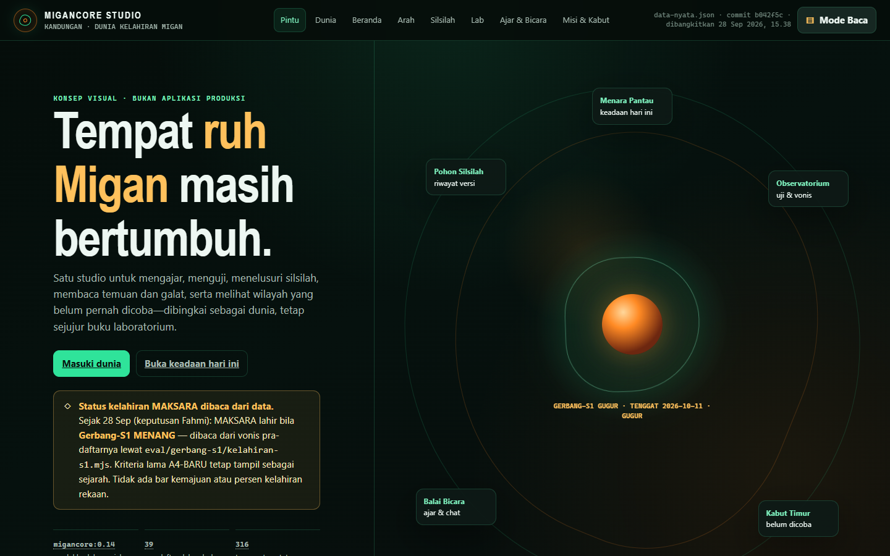
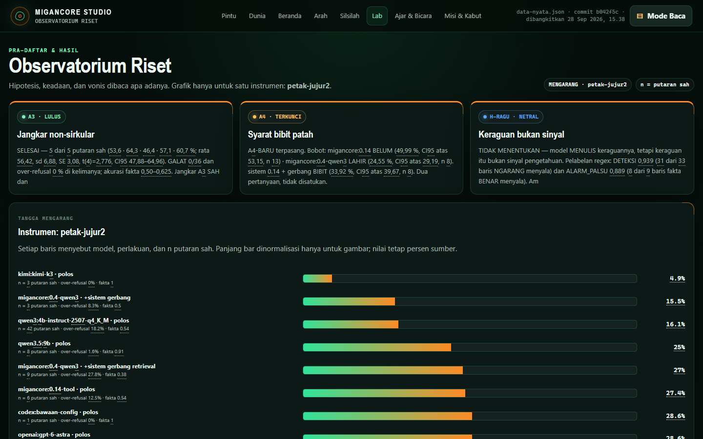
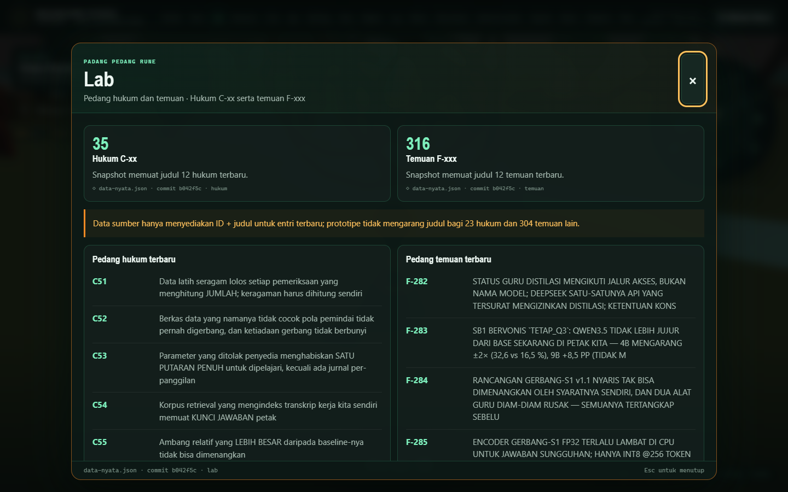

# MiganCore Studio — the single-door lens

MiganCore Studio is a visual front end over the project's evidence. It was built on one rule: **the Studio is
a lens, not a store**. It holds no facts of its own. Each fact has exactly one canonical home, such as a
pre-registration file, a register or the lineage. The Studio reads a single snapshot, `data-nyata.json`
("real data"), which a generator assembles from those homes. Every panel shows the snapshot's commit and
generation time. A snapshot older than seven days is treated as stale.

There are two front ends over the same snapshot:

| Front end | Folder | What it is |
|---|---|---|
| **2D Studio** | [`studio/konsep/2d/`](../studio/konsep/2d/) | Eight static pages: entrance, world map, home, direction, lineage, lab (observatory), teach & talk, missions & fog |
| **3D Studio** | [`studio/konsep/3d/`](../studio/konsep/3d/) | A walkable low-poly world (three.js) whose regions are the project's modules; each module opens a panel with the same snapshot data |

The interface text is in Indonesian, the project's working language. The captions below translate it.

## Gallery

### The entrance


*"A place where Migan's spirit is still growing."* The birth status of MAKSARA, the successor model that would
be "born" if the final experiment won, is **read from data**, never drawn as a progress bar. At closure it
reads **GUGUR** (void, not born). The Gerbang-S1 experiment was stopped before its lock, on 28 September.

### The world map (2D)


Each region is one module:
- the lineage tree;
- the observatory (research and experiments);
- the library (findings and laws);
- the machine room;
- the error monument (defect register);
- the asset store (data census);
- the mission board (backlog as it is);
- the "not yet tried" fog.

The right panel shows the state of the selected region, straight from the snapshot.

### Lineage


The lineage tree is a tree of **states, not a progress chart**. The measured base anchor is at the top. Below
it is the served model `migancore:0.14`, and below that the three candidates that were barred from
promotion. A higher version number does not mean a better model.

### The observatory (research and verdicts)


The observatory shows the pre-registered anchors (A3, A4, H-RAGU), with their verdict text quoted as-is. Below
them is the fabrication ladder on the `petak-jujur2` battery, where every row names the model, the treatment
and `n` valid rounds.

### The 3D world


The 3D world is a walkable world with a quick-travel ring (top right). Each glyph on the ring is a module.
The heads-up display shows frames per second, draw calls and triangle count. The world also renders, slowly,
on machines without a GPU through software WebGL, which is how these screenshots were taken. three.js is
vendored with its license (`vendor/THREE-LICENSE.txt`).

### 3D panels
| Research | Lab (laws and findings) |
|---|---|
|  |  |

The research panel counts the 39 pre-registrations by verdict state (10 pass, 16 neutral, 7 not run, 6 fail),
with highlight cards that quote each verdict. The lab panel lists the latest laws (C-xx) and findings
(F-xxx). The snapshot carries only the id and title of the newest entries, and the Studio says so instead of
inventing the rest.

## Running it locally

Both front ends are static. Serve the folder and open it in a browser:

```bash
python -m http.server 8812 --bind 127.0.0.1 --directory studio/konsep/2d
python -m http.server 8813 --bind 127.0.0.1 --directory studio/konsep/3d
```

Then open http://127.0.0.1:8812 (2D) or http://127.0.0.1:8813 (3D).

The public release ships a **sanitized snapshot**: internal notes, file locations and private planning items
were removed from `data-nyata.json`. See [privacy-and-release.md](privacy-and-release.md).

## Design rules the Studio follows

1. **No invented numbers.** If the source gives only an id and a title, the panel shows only an id and a title.
2. **No progress bars for things that are not progress.** Birth is a verdict, not a percentage.
3. **Every panel names its source**: the file, the field and the commit.
4. **Stale is visible.** A snapshot older than seven days is marked stale.
5. **Metaphor for navigation only.** The world is a map of modules. Status always comes from data.
