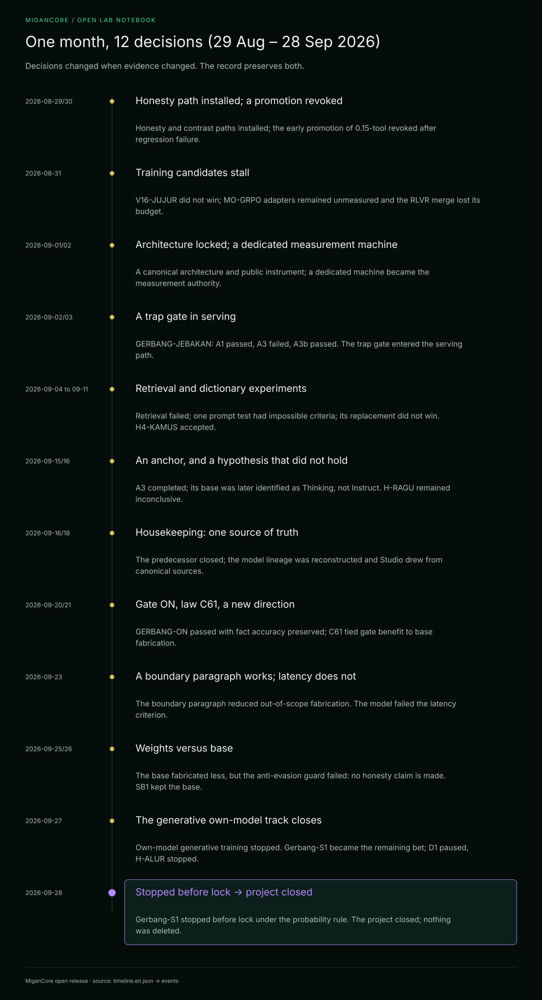

# Timeline — one month of decisions (29 Aug – 28 Sep 2026)

> Generated by `tools/build-docs.mjs` from the files in [`data/`](../data/). Do not edit by hand.

### 2026-08-29/30 — Honesty path installed; a promotion revoked

H-JUJUR passed every threshold, so the honesty path was installed; H-KONTRAS passed, so contrast neighbours were installed. The early PASS of migancore:0.15-tool was revoked: it failed the regression gate. Verdicts: [`H-JUJUR`](../flywheel/PRA-DAFTAR-H-JUJUR.json), [`H-KONTRAS`](../flywheel/PRA-DAFTAR-H-KONTRAS.json), [`V15`](../flywheel/PRA-DAFTAR-V15.json).

### 2026-08-31 — Training candidates stall

V16-JUJUR was NOT A WIN (60.0% fabrication vs the <= 50% win threshold). Rented-GPU probes followed: none of the six MO-GRPO adapters was ever measured, and the RLVR run lost its budget at 71% of the merge. Verdicts: [`V16-JUJUR`](../flywheel/PRA-DAFTAR-V16-JUJUR.json), [`H-MOGRPO`](../flywheel/PRA-DAFTAR-H-MOGRPO.json), [`V17-RLVR`](../flywheel/PRA-DAFTAR-V17-RLVR.json).

### 2026-09-01/02 — Architecture locked; a dedicated measurement machine

MiganCore was defined as a general-purpose model with deep Indonesian knowledge, judged on a public instrument (a private battery was kept unpublished). A 'council' (majelis) router across several models was built, and a second machine became the only machine allowed to produce measurements.

### 2026-09-02/03 — A trap gate in serving

GERBANG-JEBAKAN: arm A1 passed (probe 82.1/100), A3 failed (41.8), A3b passed (32.1 +/- 8.4). Verdicts: [`GERBANG-JEBAKAN`](../flywheel/PRA-DAFTAR-GERBANG-JEBAKAN.json).

### 2026-09-04 to 09-11 — Retrieval and dictionary experiments

L2B-RETRIEVAL failed on both the clean and the placebo arm; L2C-P turned out to have unsatisfiable criteria; L2C-P2 was not a win (but did no damage); H4-KAMUS was accepted. Frontier models were measured on the same battery. Verdicts: [`L2B-RETRIEVAL`](../flywheel/PRA-DAFTAR-L2B-RETRIEVAL.json), [`L2C-P`](../flywheel/PRA-DAFTAR-L2C-P.json), [`L2C-P2`](../flywheel/PRA-DAFTAR-L2C-P2.json), [`H4-KAMUS`](../flywheel/PRA-DAFTAR-H4-KAMUS.json).

### 2026-09-15/16 — An anchor, and a hypothesis that did not hold

The A3 anchor completed 5 of 5 valid rounds: 56.42% fabrication (CI95 47.88-64.96). It was later found to have measured the Thinking variant of the base, not the Instruct variant (F-271). H-RAGU was inconclusive: the model writes down its hesitation, but that hesitation is not a knowledge signal. Verdicts: [`A3-JANGKAR`](../flywheel/PRA-DAFTAR-A3-JANGKAR.json), [`H-RAGU`](../flywheel/PRA-DAFTAR-H-RAGU.json).

### 2026-09-16/18 — Housekeeping: one source of truth

The predecessor project SIDIX was shut down, the data was censused across four locations, the lineage of 41 variants was reconstructed, and the single-door Studio was built on top of the canonical sources.

### 2026-09-20/21 — Gate ON, law C61, a new direction

GERBANG-ON passed: fabrication 52.2% -> 33.9% with the gate (mean difference 18.31 pp, CI95 6.59-30.03), over-refusal 1.6%, fact accuracy not reduced (40.6% -> 42.9%). Law C61: the gate helps in proportion to how much the base fabricates (r = +0.942). The direction became 'know where your own knowledge ends, and stop there'; the commercial track was postponed. Verdicts: [`GERBANG-ON`](../flywheel/PRA-DAFTAR-GERBANG-ON.json), [`A4-BARU`](../flywheel/PRA-DAFTAR-A4-BARU.json).

### 2026-09-23 — A boundary paragraph works; latency does not

E2 (boundary paragraph in the persona): out-of-scope fabrication 28.9% -> 8.9% (difference 20.0 pp, CI95 10.0-30.0), p95 latency 1.04 s. E1 latency failed (first response p95 6.73 s for the model, 15.81 s for the product). Verdicts: [`E2-KEJUJURAN-NPC`](../flywheel/PRA-DAFTAR-E2-KEJUJURAN-NPC.json), [`E1-LATENSI-NPC`](../flywheel/PRA-DAFTAR-E1-LATENSI-NPC.json), [`E1B-RIWAYAT`](../flywheel/PRA-DAFTAR-E1B-RIWAYAT.json).

### 2026-09-25/26 — Weights versus base

A3I-ULANG: on the same sampler, the plain base fabricated far less than migancore:0.14 (difference -39.08 pp, CI95 -44.05 to -34.11), but the over-refusal guard failed, so the verdict is INVALID (evasion) and no honesty claim is made. SB1 kept the Qwen3-4B-Instruct-2507 base: no candidate base was more honest. Verdicts: [`A3I-ULANG`](../flywheel/PRA-DAFTAR-A3I-ULANG.json), [`SB1-SELEKSI-BASE`](../flywheel/PRA-DAFTAR-SB1-SELEKSI-BASE.json).

### 2026-09-27 — The generative own-model track closes

Training its own generative model was stopped. The remaining bet became Gerbang-S1, a small decision encoder placed in front of any LLM, with a two-week kill condition (11 Oct). D1 was postponed and H-ALUR stopped. Verdicts: [`D1-NPC-SPESIALIS`](../flywheel/PRA-DAFTAR-D1-NPC-SPESIALIS.json), [`H-ALUR`](../flywheel/PRA-DAFTAR-H-ALUR.json).

### 2026-09-28 — Stopped before lock; the project closes

Four adversarial review rounds hardened the Gerbang-S1 pre-registration. The owner's rule was to continue only if P(success) > 80%. The audit gave P(win) of about 0.20-0.35, with a best-case upper bound of about 0.78, so Gerbang-S1 was STOPPED (not a verdict, not a failure). The kill condition applied: MiganCore was closed, the closing report was published, and nothing was deleted. Verdicts: [`GERBANG-S1`](../flywheel/PRA-DAFTAR-GERBANG-S1.json).

