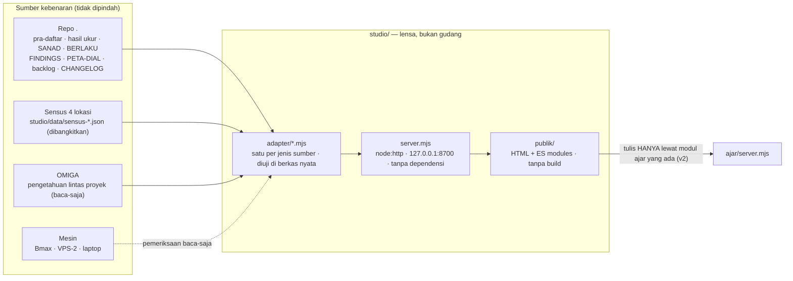

# ARD — MiganCore Studio · arsitektur dan keputusan

| | |
|---|---|
| **Versi** | 0.1 · draf · 18 Sep 2026 |
| **Status keputusan** | AD-01 … AD-12 **diusulkan**, berlaku setelah v0 dibangun dan diverifikasi |
| **Dokumen saudara** | [PRD](PRD.md) · [ERD](ERD.md) · [Sumber kebenaran](SUMBER-KEBENARAN.md) · [DEVLOG](DEVLOG.md) |

## 1. Gambaran



## 2. Keputusan

### AD-01 · Studio adalah lensa, bukan gudang
Fakta tetap tinggal di sumbernya (repo, OMIGA, mesin). Studio **membaca**. Indeks atau cache apa pun
harus bisa dihapus lalu dibangkitkan ulang tanpa kehilangan satu fakta pun — pola yang sama dengan
`flywheel/bangun-silsilah.mjs` ("dibangkitkan, bukan diketik").
*Alasan:* kelas cacat terbesar proyek ini adalah dua salinan fakta yang saling menyimpang (V15, A3, `0.13`).
*Penjaga:* `migan periksa` menolak berkas fakta yang ditulis tangan di dalam `studio/`.

### AD-02 · Satu server lokal tanpa dependensi dan tanpa build
`node:http` + ES modules (Node ≥ 22), bind **`127.0.0.1:8700`**. Frontend HTML + ES modules biasa, tanpa
bundler, tanpa CDN saat berjalan (fon dan ikon disimpan lokal).
*Alasan:* laptop sempit (RAM bebas 1,9 GB, disk 19 GB saat diukur); pola `bengkel/server` dan
`<memory-dir>\ui\serve.js` sudah membuktikannya; satu paket npm tersusupi tidak sepadan.

### AD-03 · Satu adapter per jenis sumber, diuji di berkas nyata
Setiap adapter mengembalikan `{ data, sumber: [{ berkas, commit | mtime, kunci }], basi: bool }`.
Uji `node --test` memakai berkas nyata di repo (bukan fixture karangan), lalu memeriksa jumlah yang
bisa dihitung ulang dengan cara lain (mis. jumlah pra-daftar = jumlah berkas `PRA-DAFTAR-*.json`).

### AD-04 · Setiap angka membawa sanad
UI tidak pernah menampilkan angka tanpa sumbernya (berkas + commit atau cap waktu). Prinsip *sanad*
yang sama dengan `models/SANAD-*.json`.

### AD-05 · Registri sumber kebenaran mesin-terbaca
`studio/sumber-kebenaran.json` memetakan tiap entitas ke jalur kanonik, alat penulisnya, dan penjaganya.
Dibaca oleh Studio **dan** oleh agen. Versi manusianya: [SUMBER-KEBENARAN.md](SUMBER-KEBENARAN.md).

### AD-06 · Rute inferensi eksplisit dan jujur
Semua panggilan model lewat satu adapter `mesin`: host dari konfigurasi (bawaan Bmax), diverifikasi
dengan **sidik mesin** (pola `capMesin` di `eval/pratinjau-a3.mjs`), bukan alamat. Laptop tidak pernah
menjadi mesin ukur. Label mesin + model selalu tampil.
*Alasan:* lencana `ollama: hidup` memeriksa laptop (doc 99 §3.1).

### AD-07 · Jalur tulis tunggal
Studio tidak punya jalur tulis sendiri untuk data riset. v2 memakai modul `ajar` yang sudah ada
(kontras, pengusul, misi kejujuran). Vonis, temuan, dan hukum ditulis agen lewat alurnya masing-masing.

### AD-08 · Gerbang pra-daftar untuk tindakan berbiaya (v3)
Tombol "jalankan ukur/latih" hanya aktif untuk pra-daftar yang terkunci (`dikunci` terisi, vonis
`belum`). Tanpa itu tombol tidak ada.

### AD-09 · Privasi dan rahasia
Daftar tolak jalur di server: `.env*`, `*credential*`, `KVM8-BACKUP/tier1*`, `memory/credentials_private.md`,
transkrip `*.jsonl` sesi. Alamat mesin disimpan di `studio/.env.studio` (diabaikan git); registri hanya
memuat peran dan sidik.

### AD-10 · Sensus dibangkitkan, bukan dicatat tangan
Skrip inventaris (laptop PowerShell ASCII, Bmax `flywheel/inventaris-bmax/*.ps1`, VPS-2 SSH baca-saja,
GitHub `gh`) menulis `studio/data/sensus-<lokasi>-<tanggal>.json`. Studio membaca yang terbaru dan
menandai umurnya.

### AD-11 · Rupa dari rancangan yang sudah ada
Token rancangan 22 Agu (dari `ajar/index.html`): latar `#0d1117` · panel `#161b22` · garis `#30363d` ·
hijau `#3fb950` · biru `#58a6ff` · kuning `#d29922` · radius 7/10/20 px · `ui-sans-serif` 15px/1.6.
Tema gelap bawaan + tema terang. Label Bahasa Indonesia polos.

### AD-12 · Dibangun per episode, diverifikasi per episode
Setiap modul = satu episode `disciplined-execution`: rancang → uji adapter di data nyata → bangun →
periksa statis → jalankan lokal → **verifikasi di peramban** → catat di DEVLOG. Codex membangun,
Claude meninjau dan memverifikasi; tidak ada modul yang dianggap selesai dari laporan pembangunnya saja.

## 3. Struktur folder

```
studio/
  server.mjs              # node:http, rute /api/* dan berkas statis
  sumber-kebenaran.json   # registri (AD-05)
  .env.studio             # alamat mesin, diabaikan git (AD-09)
  adapter/                # satu berkas per jenis sumber + *.test.mjs
  data/                   # HANYA hasil bangkitan (sensus, cache) — boleh dihapus
  publik/                 # index.html, gaya.css, modul/*.mjs
  docs/                   # PRD, ARD, ERD, SUMBER-KEBENARAN, DEVLOG
```

## 4. API (v0)

| Rute | Adapter | Isi |
|---|---|---|
| `GET /api/beranda` | gabungan | ringkasan kartu M1 |
| `GET /api/pra-daftar` · `/api/pra-daftar/:id` | `pra-daftar` | daftar + rinci, termasuk ramalan & vonis |
| `GET /api/temuan` · `/api/hukum` · `/api/cacat` | `temuan`, `hukum`, `cacat` | hasil parse FINDINGS_LOG, PETA-DIAL-LATIH, REGISTER-CACAT |
| `GET /api/silsilah` | `silsilah` | generasi, sanad, lokasi artefak |
| `GET /api/backlog` | `backlog` | episode doc 93/96 + status turunan |
| `GET /api/aset` | `sensus` | sensus terbaru + jumlah salinan |
| `GET /api/log` | `log` | CHANGELOG + living log (tanpa transkrip) |
| `GET /api/mesin` | `mesin` | peran, sidik, kesehatan (baca-saja) |

Setiap respons: `{ data, sumber, dibangkitkan, basi }`.

## 5. Anggaran & mutu

Memori server < 80 MB · muat awal < 1 detik di laptop · tanpa CDN saat berjalan · `node --test studio/adapter`
hijau · `migan periksa` memuat penjaga Studio · aksesibilitas: kontras AA, navigasi papan ketik.
