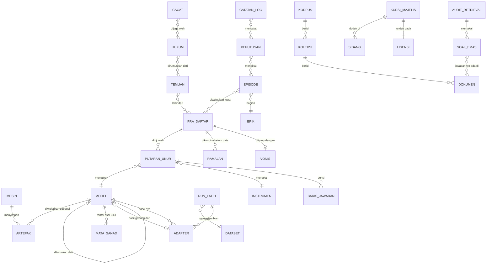

# ERD — MiganCore Studio · model data riset

| | |
|---|---|
| **Versi** | 0.1 · draf · 18 Sep 2026 |
| **Aturan** | Entitas di bawah adalah **tampilan terstruktur atas sumber yang sudah ada**, bukan tabel basis data baru (ARD AD-01). Kolom "sumber kanonik" menunjuk tempat fakta itu hidup. |

## 1. Diagram

## 2. Entitas, atribut kunci, dan sumber kanoniknya

| Entitas | Atribut kunci | Sumber kanonik | Keterangan |
|---|---|---|---|
| **MESIN** | nama (laptop/Bmax/VPS-2), peran, sidik, status Ollama, jembatan | `studio/sumber-kebenaran.json` (peran) + pemeriksaan hidup; alamat di `.env.studio` | Sidik lebih dipercaya daripada alamat (DHCP bergeser) |
| **ARTEFAK** | jenis (gguf/adapter/blob/dataset/arsip), jalur, ukuran, sha256, mtime, mesin | `studio/data/sensus-*.json` (dibangkitkan) | Jumlah salinan = hitungan artefak dengan sha256 sama |
| **MODEL** | tag (`migancore:0.14`), generasi, base, status (berlaku/arsip/dilarang) | `models/BERLAKU.json` · arsip silsilah dibangkitkan | Tidak ada daftar model yang diketik ulang |
| **MATA_SANAD** | urutan, jenis mata (data/latih/kemas/ukur/vonis), status (bersambung/dhaif) | `models/SANAD-*.json` | Dilaporkan `migan.mjs status` |
| **RUN_LATIH** | id, tanggal, infrastruktur (vast/kaggle/lokal), biaya, log | `flywheel/lajur-latihan.mjs` + log run di `flywheel/vast/` | Run tanpa log = hipotesis tak teruji (C59) |
| **DATASET** | nama, jumlah baris, komposisi, rasio menolak:menjawab | `flywheel/dataset/*`, pra-daftar kontrak latih | |
| **ADAPTER** | jalur, base, konfigurasi (`adapter_config.json`), ukuran | sensus + folder adapter | MO-GRPO & RLVR: **belum ditemukan** |
| **PRA_DAFTAR** | id, judul, hipotesis, ambang, `dikunci`, amandemen | `flywheel/PRA-DAFTAR-*.json` | 24 berkas per 18 Sep |
| **RAMALAN** | peramal (Claude/Codex/…), peluang per hasil, skor Brier | kunci `ramalan*` di pra-daftar | Dinilai setelah vonis |
| **VONIS** | hasil, `keadaan` (lulus/gagal/netral/belum), tanggal | kunci `vonis` di pra-daftar | Dijaga `jaga-vonis`, `jaga-vonis-basi` |
| **PUTARAN_UKUR** | berkas, model, stempel, `sah`, galat, kondisi (batasDetik, aliran, pikir) | `eval/hasil-*.json` | Dibaca apa adanya; tidak pernah disunting |
| **INSTRUMEN** | nama (petak-jujur2, petak-40, gerbang alat, regresi), jumlah soal, kamus | `eval/petak-jujur2.mjs`, `eval/instrumen-jujur2.mjs` | Angka lintas instrumen tidak boleh dibandingkan tanpa label |
| **BARIS_JAWABAN** | soal, jenis, hasil, sinyal, teks, pikir | di dalam `eval/hasil-*.json` | `pikir` tersimpan sejak putaran A3 ke-4 |
| **TEMUAN** | F-xxx, judul, tanggal, bukti | `docs/jarvis/FINDINGS_LOG.md` | Diurai dari baris `- **F-xxx — …**` |
| **HUKUM** | C-xx, judul, kejadian, pola umum | `PETA-DIAL-LATIH.md` | Diurai dari judul `## Cxx - …` |
| **CACAT** | kelas, penjaga, status | `eval/REGISTER-CACAT.json` | |
| **EPIK / EPISODE** | kode (A3, K10, …), tujuan, syarat, status | `docs/jarvis/93_RENCANA_MENUJU_BIBIT.md`, `96_BACKLOG_MENUJU_MAKSARA.md` | Status diturunkan dari vonis bila tertaut |
| **KORPUS / KOLEKSI / DOKUMEN** | nama, jumlah dokumen, sumber | OMIGA `corpus/`, cadangan qdrant di Bmax (metadata saja) | Isi `tier1` tidak dibaca |
| **AUDIT_RETRIEVAL / SOAL_EMAS** | golden set, recall@k, MRR, nDCG | `<memory-dir>\scripts\golden.jsonl`, `<memory-dir>\corpus\eval\*.json` | Pola audit OMIGA dipakai ulang untuk MiganCore |
| **KURSI_MAJELIS / SIDANG / LISENSI** | model, penyedia, izin distilasi, jalur akses | `majelis/` + riset guru (18 Sep) | Model tanpa izin distilasi tidak bisa menjadi guru distilasi |
| **KEPUTUSAN** | AD-xx / D-xxx, isi, alasan, tanggal | `studio/docs/ARD.md`, OMIGA `BOOK/09-DECISIONS.md` | |
| **CATATAN_LOG** | tanggal, jenis (changelog/living log/handoff) | `docs/jarvis/CHANGELOG.md`, `riset/*/LIVING_LOG.md`, `HANDOFF-*.md` | Transkrip sesi **tidak** termasuk |

## 3. Aturan integritas yang harus dijaga penjaga

1. Setiap `PUTARAN_UKUR` yang dirujuk vonis harus ada berkasnya (C59).
2. Klaim "N dari M putaran sah" di `VONIS` harus sama dengan hitungan berkas (`jaga-vonis-basi`).
3. `MODEL.status = berlaku` hanya untuk satu tag per jalur (`models/BERLAKU.json`).
4. `ARTEFAK` model berlaku harus punya **≥ 2 salinan** di mesin berbeda — penjaga baru (v0).
5. `KURSI_MAJELIS.peran = guru distilasi` mensyaratkan `LISENSI.izin_distilasi = YA` dengan kutipan sumber.
